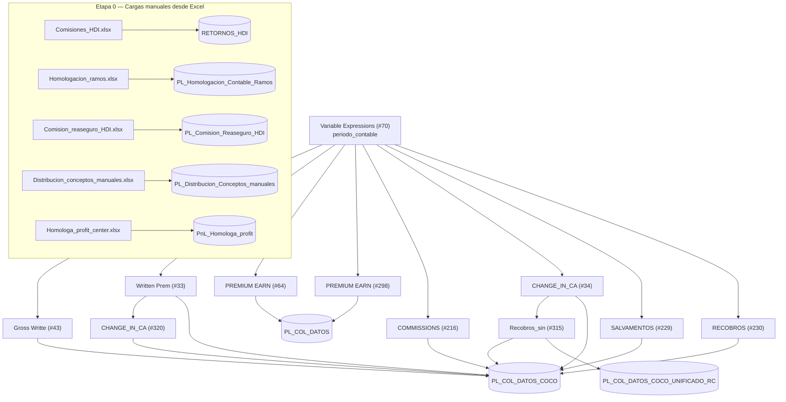

# Guía completa del proyecto (lenguaje sencillo)

> Este documento une, en un solo lugar y con palabras simples, todo lo que explicaban por separado
> `EXPLICACION_FLUJO.md`, `FLUJO.md` y `FLUJO_PL_COL_DATOS_COCO_COMISIONES.md`. Cada vez que aparece
> un término de negocio o de seguros, se explica ahí mismo entre paréntesis o en una nota corta.
> El detalle exhaustivo de los 475 scripts (archivo por archivo) se dejó únicamente en
> [`FLUJO.md`](FLUJO.md) para no repetir tablas enormes dos veces; aquí se explica **qué hace todo y por qué**.

## 1. ¿Qué es este proyecto, en una frase?

Es la extracción y documentación del SQL que hay adentro de un workflow de KNIME (una herramienta que
encadena pasos de proceso de datos con "cajitas" visuales, sin que el usuario tenga que programar todo a
mano) llamado `P&G_COCO.knwf`. Ese workflow arma el **P&G** (Pérdidas y Ganancias, es decir el estado de
resultados contable: cuánto entra y cuánto sale de dinero) de HDI Colombia para un mes específico.

KNIME no calcula nada por sí mismo: solo decide el **orden** en que se ejecutan 475 sentencias SQL contra
SQL Server, y mueve los resultados finales a un par de tablas permanentes. Toda la lógica de negocio real
vive en ese SQL.

## 2. Un solo parámetro dispara todo: `periodo_contable`

Hay un nodo especial (`Variable Expressions #70`) que define una variable llamada `periodo_contable`, con
formato `AAAAMM` (ejemplo: `202512` = diciembre de 2025). Esa variable se inserta en casi todos los
scripts como si fuera un espacio en blanco que KNIME rellena antes de ejecutar:

```sql
declare @periodo_contable varchar(6) = $${Speriodo_contable}$$
...
WHERE t1.periodo_contable >= @periodo_contable
```

Esa única variable alimenta los 9 componentes principales del workflow y define qué mes se está
procesando. Si se quiere correr un script suelto fuera de KNIME, hay que reemplazar ese texto por un valor
fijo, por ejemplo `'202506'`.

## 3. El patrón que se repite en (casi) todos los componentes

Cada "componente" (cada cajita grande de KNIME que calcula un concepto del P&G, como comisiones o
siniestros) sigue siempre la misma receta de 3 pasos:

1. **DDL** (`DB SQL Executor`): borra y vuelve a crear tablas **temporales** (tablas que solo existen
   durante la sesión, identificadas porque su nombre empieza con `#`, ej. `#primas_pyg`). Cada script parte
   de la temporal que dejó el anterior, formando una cadena (`#primas_pyg` → `#profit` →
   `#cocorretaje_completo` → …).
2. **DML** (`DB Query Reader`): un `SELECT` final que junta y suma todo lo anterior, agrupado por
   periodo/ramo (tipo de seguro, ej. autos, vida)/póliza/intermediario (la persona o empresa que vendió el
   seguro)/profit center (la unidad de negocio contable a la que se le atribuye el resultado).
3. **Insert**: KNIME toma ese resultado y lo guarda con un nodo `DB Insert` en la tabla permanente
   (`PL_COL_DATOS_COCO` o `PL_COL_DATOS`). Este paso no tiene archivo `.sql` propio porque KNIME lo genera
   internamente, no es una consulta escrita a mano.

> **Nota de clasificación DDL vs DML:** un script se marca como DDL si crea o borra objetos (`CREATE
> TABLE`, `DROP TABLE`, `ALTER`, `TRUNCATE`, o `SELECT … INTO`, que en SQL Server crea una tabla nueva a
> partir de un `SELECT`). Se marca como DML si solo lee o modifica datos ya existentes (`SELECT`,
> `INSERT`, `UPDATE`, `DELETE`). De los 475 scripts, 317 son DDL y 158 son DML.

### Ejemplo real de un paso DDL (construir la temporal base de "Gross Writte")

```sql
-- DB_SQL_Executor__2.sql (Gross Writte #43)
if OBJECT_ID('tempdb.dbo.#primas_pyg','U') is not null drop table #primas_pyg

select
    t1.PERIODO_CONTABLE, t1.SSEGURO, t1.SUCURSAL_PROD, t1.RAMO_PROD, ...
    ,sum(isnull(t1.vr_prima_documento_coa,0)
          - iif(t1.ramo_prod = 'AO', isnull(t1.vr_prima_mn_orig,0), 0)
          - iif(t1.ramo_prod = '900730', isnull(t1.vr_contribucion,0), 0)) as GROSS_WRITTEN_PREMIUM
into #primas_pyg
from liberty.prod.dwh_pol_amp_h t1
left join liberty.prod.dwh_polizas_h t3 on t1.llave = t3.llave
left join liberty.apoyo.dwh_sbu_ramo_prod t2 on t1.ramo_prod = t2.ramo_prod
left join liberty.apoyo.dwh_profitcenter t4
    on t4.ramo_prod = t1.ramo_prod and t4.sucursal = t1.sucursal_prod and t4.ramo_contable = t1.ramo_contable
where t1.periodo_contable >= @periodo_contable
group by ...
```

**Traducción a palabras simples:** "borra la tabla temporal de primas si ya existía, y vuelve a calcular
la prima emitida bruta (`GROSS_WRITTEN_PREMIUM` = lo que el cliente pagó por la póliza, sin descontar
todavía nada de reaseguro) del periodo pedido, cruzando la póliza con su ramo (tipo de seguro) y su profit
center (unidad de negocio contable)".

### Ejemplo real de un paso DML (lo que KNIME finalmente lee)

```sql
-- DB_Query_Reader__6.sql (Gross Writte #43)
select * from #primas_pyg_inter
```

Así de simple: solo lee la tabla temporal ya armada y se la entrega a KNIME para insertarla en la tabla
final.

## 4. El bloque que más se repite: "homologación de profit center"

Casi todos los componentes necesitan traducir códigos internos al **profit center** (la unidad de negocio
contable, ej. "Autos Bogotá") usando una tabla de referencia (`homologa_profit_center`) que tiene 9
variantes numeradas (`opcion = 1` a `9`), cada una con una combinación de llaves cada vez menos estricta.
El SQL prueba la opción 1, si no encuentra nada prueba la 2, y así sucesivamente, quedándose con el primer
resultado no vacío (`COALESCE`):

```sql
select
    t1.*,
    coalesce(pc2.mapped_sapprofitcenter, pc3.mapped_sapprofitcenter, pc4.mapped_sapprofitcenter,
             pc5.mapped_sapprofitcenter, pc6.mapped_sapprofitcenter, pc7.mapped_sapprofitcenter,
             pc8.mapped_sapprofitcenter, pc9.mapped_sapprofitcenter) as Profit_nuevo
into #profit
from #primas_pyg t1
left join (select * from liberty.amocom.homologa_profit_center where opcion = 1) pc1
    on t1.ramo_contable = pc1.ramo_contable and t1.ramo_prod = pc1.ramo_producto_tecnico
   and t1.sucursal_prod = pc1.sucursal_contable and t1.modalidad = pc1.modalidad
left join (select * from liberty.amocom.homologa_profit_center where opcion = 2) pc2
    on t1.ramo_contable = pc2.ramo_contable and t1.ramo_prod = pc2.ramo_producto_tecnico
   and t1.sucursal_prod = pc2.sucursal_contable
-- ... hasta opcion = 8
cross join (select * from liberty.amocom.homologa_profit_center where opcion = 9) pc9
```

Este bloque aparece casi textual en decenas de scripts distintos: es la pieza de código más reutilizada de
todo el proyecto.

## 5. Antes de calcular nada: 5 cargas manuales desde Excel

Al inicio del flujo, 5 archivos de Excel se suben a tablas auxiliares (sin escribir SQL — son nodos
`Excel Reader` → `DB Table Creator` → `DB Insert`):

| Archivo Excel | Tabla destino | Para qué sirve |
|---|---|---|
| `Comisiones_HDI.xlsx` | `RETORNOS_HDI` | Comisiones/retornos que se cargan a mano |
| `Homologacion_ramos.xlsx` | `PL_Homologacion_Contable_Ramos` | Traduce el ramo contable al ramo comercial |
| `Comision_reaseguro_HDI.xlsx` | `PL_Comision_Reaseguro_HDI` | Porcentaje de comisión que paga el reasegurador |
| `Distribucion_conceptos_manuales.xlsx` | `PL_Distribucion_Conceptos_manuales` | Cómo repartir conceptos que se cargan manualmente |
| `Homologa_profit_center.xlsx` | `PNL_HOMOLOGA_PROFIT` | La tabla de homologación de profit center explicada en la sección 4 — es la más usada de todo el flujo (117 referencias) |

## 6. Los componentes del flujo: qué calcula cada uno

| Componente | Qué calcula, en simple | Escribe en |
|---|---|---|
| **Gross Writte (#43)** | Prima emitida bruta: cuánto pagó el cliente por la póliza | `PL_COL_DATOS_COCO` |
| **Written Prem (#33)** | Prima cedida: cuánto de esa plata se le pasa al reasegurador | `PL_COL_DATOS_COCO` |
| **PREMIUM EARN (#64)** | Prima devengada: la parte de la prima que ya "se ganó" con el tiempo (una póliza de un año no se gana toda de una vez, se va devengando mes a mes) | `PL_COL_DATOS` |
| **PREMIUM EARN (#298)** | Lo mismo que #64 pero repartido entre los intermediarios que comparten la venta (cocorretaje) | `PL_COL_DATOS` |
| **COMMISSIONS (#216)** | Cuánto se paga en comisiones a los intermediarios, y cuánta comisión se recibe del reasegurador | `PL_COL_DATOS_COCO` |
| **CHANGE_IN_CA (#34 / #320)** | Cómo cambió la reserva de siniestros (plata apartada para pagar reclamos ya ocurridos pero no cerrados) y lo que ya se pagó | `PL_COL_DATOS_COCO` |
| **SALVAMENTOS (#229)** | Plata recuperada vendiendo lo que queda de un bien siniestrado (ej. los restos de un carro chocado) | `PL_COL_DATOS_COCO` |
| **RECOBROS (#230)** | Plata recuperada de terceros o del reasegurador después de pagar un siniestro | `PL_COL_DATOS_COCO` |
| **Recobros_sin (#315)** | Descuentos comerciales que se le aplican a esos recobros | `PL_COL_DATOS_COCO_UNIFICADO_RC` |

También existen variantes que **no están conectadas** al flujo activo (`COMMISSIONS #278`,
`COMMISSIONS_ #287`), que parecen versiones de respaldo o pruebas — no se ejecutan hoy.

Y hay componentes autónomos que corren aparte, sin conexión visible en el nivel superior del workflow:
`LOADS (#205)` (asistencias en carretera y gastos asociados al siniestro), `GASTOS (#221)` (gastos
generales no asignables a un ramo específico), `IMPUESTOS (#225)` (impuestos, licencias y tasas), y
`XL_Cost (#73)` (costo del reaseguro de exceso de pérdida, un tipo de contrato de reaseguro que cubre
siniestros muy grandes).

### Diagrama general



## 7. ¿De dónde salen exactamente los datos de `PL_COL_DATOS_COCO`?

`PL_COL_DATOS_COCO` es la tabla donde queda guardado, ya calculado, todo el resultado financiero del
negocio compartido con otros intermediarios. Ese reparto se llama **cocorretaje**: cuando una póliza no la
vende un solo intermediario sino que se reparte entre varios según un porcentaje llamado
**PARTICIPACION**.

Esa tabla **no la llena una sola consulta**: la llenan **8 de los procesos** de la sección 6 (Gross
Writte, Written Prem, COMMISSIONS, los dos CHANGE_IN_CA, SALVAMENTOS, RECOBROS y Recobros_sin). Cada uno
termina con el paso "Insert" de KNIME que mete su resultado en la tabla.

No existe ninguna tabla llamada `pl_col_datos_coco_comisiones` — ese nombre no aparece en el proyecto. Lo
que sí existe es el componente `COMMISSIONS`, que calcula las comisiones y las guarda dentro de
`PL_COL_DATOS_COCO` junto con todo lo demás.

**Sobre las comisiones específicamente:** el proceso `COMMISSIONS` calcula dos cosas — el **gasto de
comisiones** (lo que la aseguradora le paga a los intermediarios por vender) y la **comisión de
reaseguro** (lo que la aseguradora recibe del reasegurador como parte del contrato). Para esto usa datos
que ya están en las bases internas de la compañía; **no lee ningún Excel**. El único Excel con nombre
parecido (`Comisiones_HDI.xlsx`, que se carga en `RETORNOS_HDI`, ver sección 5) queda sin conectar a este
cálculo — se sube pero ninguna consulta de `COMMISSIONS` lo usa.

El orden en que estos 8 procesos escriben en la tabla sigue el orden documentado en
[`FLUJO.md`](FLUJO.md). Los pasos Written Prem → CHANGE_IN_CA(#320) → CHANGE_IN_CA(#34) → Recobros_sin
tienen conexiones explícitas (uno depende del resultado del anterior). El orden de SALVAMENTOS y RECOBROS
respecto al resto no se pudo confirmar con certeza documentalmente.

### ¿Dónde leer el SQL completo de esos 8 procesos, ya comentado?

Las 203 consultas de esos 8 procesos están unidas en un solo archivo, en el orden explicado arriba, con
comentarios en español simple pegados encima de cada consulta (sin tocar el código original):

📄 [`sql/CONSOLIDADO_PL_COL_DATOS_COCO/PL_COL_DATOS_COCO_completo.sql`](../sql/CONSOLIDADO_PL_COL_DATOS_COCO/PL_COL_DATOS_COCO_completo.sql)

⚠️ **Importante:** ese archivo es solo para **leer y entender**, no para ejecutarlo tal cual contra una
base de datos real. Como junta 203 consultas una detrás de otra, varias reutilizan el mismo nombre de
tabla temporal (las que empiezan con `#`), así que si se corre todo junto se pisan entre sí. Cada consulta
se debe seguir ejecutando dentro de su propio proceso, tal como está organizado en `sql/<proceso>/`.

## 8. Dónde está cada cosa en el repositorio

- **Detalle archivo por archivo** de los 475 scripts (qué tabla temporal crea cada uno, de dónde lee, tipo
  DDL/DML): [`FLUJO.md`](FLUJO.md). Es una referencia exhaustiva, pensada para consultar un script puntual,
  no para leer de corrido.
- **Scripts SQL organizados** por componente y por DDL/DML: [`../sql/`](../sql/).
- **SQL consolidado y comentado** de los 8 procesos que arman `PL_COL_DATOS_COCO`:
  [`../sql/CONSOLIDADO_PL_COL_DATOS_COCO/PL_COL_DATOS_COCO_completo.sql`](../sql/CONSOLIDADO_PL_COL_DATOS_COCO/PL_COL_DATOS_COCO_completo.sql).

## 9. Resumen para quien tenga prisa

- El proyecto documenta y organiza el SQL (475 scripts) de un workflow de KNIME que arma el P&G contable
  mensual de HDI Colombia.
- Todo se dispara con un solo parámetro: el mes a procesar (`periodo_contable`).
- Cada componente sigue el mismo patrón: prepara tablas temporales (DDL), las consulta (DML), y KNIME
  inserta el resultado en una tabla permanente.
- La tabla `PL_COL_DATOS_COCO` (el resultado del negocio compartido entre intermediarios, "cocorretaje")
  la llenan 8 procesos distintos, no uno solo.
- Las comisiones las calcula el proceso `COMMISSIONS` con datos internos, no con un Excel.
