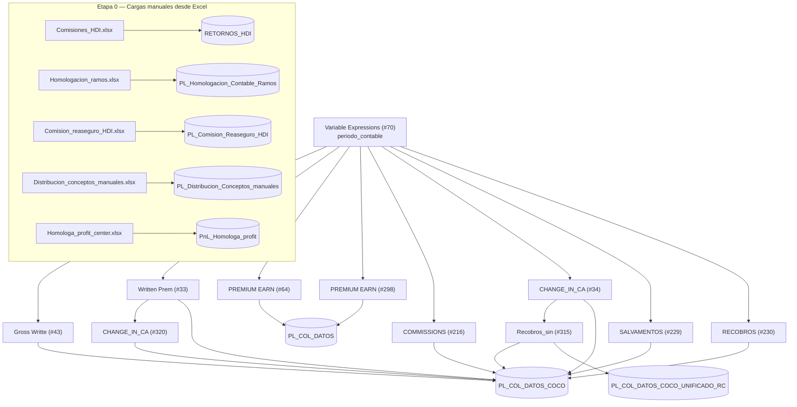

# Explicación del flujo KNIME `P&G_COCO` (con fragmentos de SQL)

> Este documento es una introducción narrada al workflow, pensada para entender **cómo funciona** antes de entrar al detalle exhaustivo de [`FLUJO.md`](FLUJO.md) (que lista los 475 scripts uno por uno).

## Qué hace el workflow

Es un proceso KNIME que arma el **P&G (estado de resultados) contable** de HDI Colombia para un `periodo_contable` dado. Toda la lógica de negocio vive en scripts **SQL Server**; KNIME solo orquesta el orden de ejecución y mueve los resultados finales a las tablas permanentes.

## 1. Un único parámetro dispara todo el flujo

El nodo `Variable Expressions (#70)` define la variable `periodo_contable` (formato `YYYYMM`, ej. `'202512'`). KNIME la sustituye en cada script como placeholder de flujo:

```sql
declare
@periodo_contable varchar(6)=$${Speriodo_contable}$$
...
WHERE t1.periodo_contable >= @periodo_contable
```

Esta variable alimenta los 9 componentes principales del workflow y define qué mes se procesa.

## 2. Patrón interno de cada componente: DDL → DML → Insert

Cada componente (Gross Writte, Written Prem, Commissions, etc.) repite la misma estructura de tres pasos:

1. **DDL** (`DB SQL Executor`): borra y reconstruye tablas temporales en `tempdb`, encadenando una temporal tras otra.
2. **DML** (`DB Query Reader`): un `SELECT` final que agrega el resultado por periodo/ramo/póliza/intermediario/profit center.
3. **Insert**: KNIME toma ese resultado con un nodo `DB Insert` y lo escribe en la tabla permanente (`PL_COL_DATOS_COCO` o `PL_COL_DATOS`).

### Ejemplo de paso DDL — construir la temporal base

```sql
-- DB_SQL_Executor__2.sql (Gross Writte #43)
if OBJECT_ID('tempdb.dbo.#primas_pyg','U') is not null drop table #primas_pyg

select
    t1.PERIODO_CONTABLE, t1.SSEGURO, t1.SUCURSAL_PROD, t1.RAMO_PROD, ...
    ,sum(isnull(t1.vr_prima_documento_coa,0)
          - iif(t1.ramo_prod = 'AO', isnull(t1.vr_prima_mn_orig,0), 0)
          - iif(t1.ramo_prod = '900730', isnull(t1.vr_contribucion,0), 0)) as GROSS_WRITTEN_PREMIUM
into #primas_pyg
from liberty.prod.dwh_pol_amp_h t1
left join liberty.prod.dwh_polizas_h t3 on t1.llave = t3.llave
left join liberty.apoyo.dwh_sbu_ramo_prod t2 on t1.ramo_prod = t2.ramo_prod
left join liberty.apoyo.dwh_profitcenter t4
    on t4.ramo_prod = t1.ramo_prod and t4.sucursal = t1.sucursal_prod and t4.ramo_contable = t1.ramo_contable
where t1.periodo_contable >= @periodo_contable
group by ...
```

Los scripts DDL posteriores parten de la temporal creada por el anterior (`#primas_pyg` → `#profit` → `#cocorretaje_completo` → …), formando una cadena. Por eso se clasifican como DDL aunque el cuerpo sea un `SELECT`: lo que importa es el efecto estructural (`SELECT … INTO` crea la tabla) porque condiciona el orden de ejecución.

### Ejemplo de paso DML — lectura final hacia KNIME

```sql
-- DB_Query_Reader__6.sql (Gross Writte #43)
select * from #primas_pyg_inter
```

## 3. Patrón recurrente: homologación de profit center

Casi todos los componentes resuelven el `profit center` con una cascada de `LEFT JOIN` sobre 9 variantes de la tabla de homologación (`liberty.amocom.homologa_profit_center`, `opcion = 1..9`), cada una con una combinación de llaves progresivamente menos estricta, y se queda con el primer match no nulo vía `COALESCE`:

```sql
select
    t1.*,
    coalesce(pc2.mapped_sapprofitcenter, pc3.mapped_sapprofitcenter, pc4.mapped_sapprofitcenter,
             pc5.mapped_sapprofitcenter, pc6.mapped_sapprofitcenter, pc7.mapped_sapprofitcenter,
             pc8.mapped_sapprofitcenter, pc9.mapped_sapprofitcenter) as Profit_nuevo
into #profit
from #primas_pyg t1
left join (select * from liberty.amocom.homologa_profit_center where opcion = 1) pc1
    on t1.ramo_contable = pc1.ramo_contable and t1.ramo_prod = pc1.ramo_producto_tecnico
   and t1.sucursal_prod = pc1.sucursal_contable and t1.modalidad = pc1.modalidad
left join (select * from liberty.amocom.homologa_profit_center where opcion = 2) pc2
    on t1.ramo_contable = pc2.ramo_contable and t1.ramo_prod = pc2.ramo_producto_tecnico
   and t1.sucursal_prod = pc2.sucursal_contable
-- ... hasta opcion = 8
cross join (select * from liberty.amocom.homologa_profit_center where opcion = 9) pc9
```

Este bloque se repite casi textual en decenas de scripts distintos — es la pieza más reutilizada del workflow.

## 4. Componentes principales conectados al flujo

| Componente | Qué calcula | Escribe en |
|---|---|---|
| **Gross Writte (#43)** | Prima emitida bruta | `PL_COL_DATOS_COCO` |
| **Written Prem (#33)** | Prima cedida al reaseguro | `PL_COL_DATOS_COCO` |
| **PREMIUM EARN (#64)** | Variación de prima no devengada (directa/cedida/SOAT/terremoto) | `PL_COL_DATOS` |
| **PREMIUM EARN (#298)** | Igual que #64, versión orientada a cocorretaje | `PL_COL_DATOS` |
| **COMMISSIONS (#216)** | Gasto de comisiones y comisión de reaseguro | `PL_COL_DATOS_COCO` |
| **CHANGE_IN_CA (#34 / #320)** | Reserva de siniestros / pagados + change in case | `PL_COL_DATOS_COCO` |
| **SALVAMENTOS (#229)** / **RECOBROS (#230)** | Salvamentos y recobros de siniestros | `PL_COL_DATOS_COCO` |
| **Recobros_sin (#315)** | Descuentos comerciales sobre recobros | `PL_COL_DATOS_COCO_UNIFICADO_RC` |

Existen variantes **no conectadas** al nivel superior del workflow (`COMMISSIONS #278`, `COMMISSIONS_ #287`), basadas en tablas `amocom.*` en vez de `comercial.*` — parecen versiones de respaldo o desarrollo, no se ejecutan en el flujo activo.

Componentes autónomos adicionales (sin conexión visible en el nivel superior): `LOADS (#205)` (assistances/ALAE/ULAE), `GASTOS (#221)` (unallocated UWE), `IMPUESTOS (#225)` (taxes), `XL_Cost (#73)`.

## 5. Etapa 0 — cargas manuales desde Excel

Antes de los cálculos, 5 archivos Excel se cargan a tablas auxiliares (nodos `Excel Reader` → `DB Table Creator` → `DB Insert`, sin SQL manual):

| Archivo | Tabla destino | Uso |
|---|---|---|
| `Comisiones_HDI.xlsx` | `RETORNOS_HDI` | Retornos/comisiones manuales |
| `Homologacion_ramos.xlsx` | `PL_Homologacion_Contable_Ramos` | Ramo contable ↔ ramo producto |
| `Comision_reaseguro_HDI.xlsx` | `PL_Comision_Reaseguro_HDI` | % comisión de reaseguro |
| `Distribucion_conceptos_manuales.xlsx` | `PL_Distribucion_Conceptos_manuales` | Llaves de reparto manual |
| `Homologa_profit_center.xlsx` | `PNL_HOMOLOGA_PROFIT` | Homologación de profit centers (117 referencias — la tabla más usada del flujo) |

Estas tablas alimentan los `LEFT JOIN` de homologación descritos en la sección 3.

## Diagrama general



## Dónde seguir

- Detalle archivo por archivo (todos los 475 scripts, con tabla temporal creada y fuentes): [`FLUJO.md`](FLUJO.md)
- Scripts SQL organizados por componente y por DDL/DML: [`../sql/`](../sql/)
