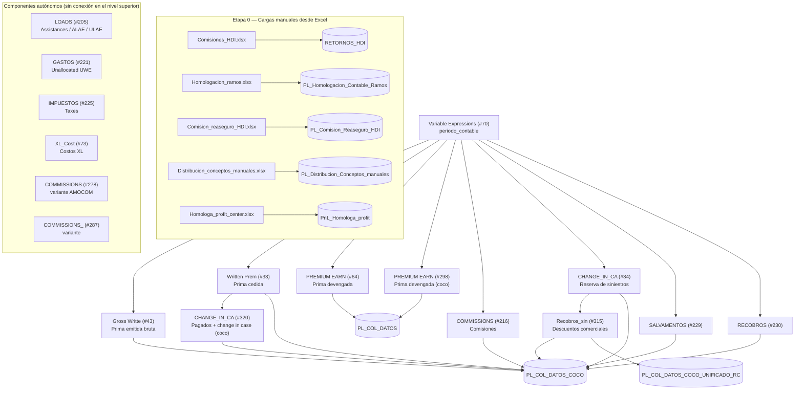

# Flujo del workflow KNIME `P&G_COCO` — SQL organizado en DDL y DML

Este documento explica **cada parte del flujo** y clasifica los 475 scripts SQL extraídos en **DDL** y **DML**. Los archivos están en [`sql/`](../sql/), con una carpeta por componente del workflow y subcarpetas `DDL/` y `DML/` dentro de cada una.

## Criterio de clasificación DDL vs DML

| Clase | Archivos | Criterio |
|---|---:|---|
| **DDL** | 317 | El script crea o elimina objetos: `CREATE TABLE`, `DROP TABLE`, `ALTER`, `TRUNCATE` o `SELECT … INTO` (que en T-SQL crea la tabla temporal destino). |
| **DML** | 158 | El script solo consulta o manipula datos: `SELECT`, `INSERT`, `UPDATE`, `DELETE`. |

> **Nota:** casi todos los scripts DDL contienen también DML (el `SELECT` que puebla la temporal que crean). Se clasifican como DDL porque su efecto estructural —crear/eliminar tablas— es lo que condiciona el orden de ejecución del flujo. Los `DB SQL Executor` de KNIME suelen ser DDL (preparan temporales en la sesión) y los `DB Query Reader` suelen ser DML (leen el resultado hacia KNIME).

## Parámetro del flujo

Todo el workflow se parametriza con **una sola variable de flujo**: `periodo_contable` (formato `YYYYMM`), definida en el nodo `Variable Expressions (#70)` (último valor guardado: `'202512'`). Aparece en los scripts como `$${Speriodo_contable}$$` (150 archivos); KNIME la sustituye en tiempo de ejecución. El nodo #70 alimenta a los 9 componentes conectados y con ello define qué mes del P&G se procesa.

## Diagrama general del flujo

**Lectura del diagrama:** la variable `periodo_contable` dispara los componentes conectados; cada componente prepara sus tablas temporales con scripts **DDL**, las consulta con scripts **DML** y KNIME inserta el resultado en las tablas `PL_COL_DATOS*` de `LIBERTY_PRUEBAS_ACTUARIA` mediante nodos `DB Insert`. Las cargas de la Etapa 0 alimentan las tablas de homologación que los componentes usan como referencia.

## Etapa 0 — Cargas manuales desde Excel

Antes de los cálculos, el workflow carga 5 archivos Excel de la carpeta `PROCESOS MENSUALES/Codigo PYG/Proceso PnL/Loads PnL/` a tablas auxiliares (nodos `Excel Reader` → `DB Table Creator` → `DB Insert`, sin SQL manual):

| Archivo Excel | Tabla destino (`LIBERTY_PRUEBAS_ACTUARIA.dbo`) | Uso |
|---|---|---|
| `Comisiones_HDI.xlsx` | `RETORNOS_HDI` | Retornos/comisiones manuales HDI |
| `Homologacion_ramos.xlsx` | `PL_Homologacion_Contable_Ramos` | Mapa ramo contable ↔ ramo producto |
| `Comision_reaseguro_HDI.xlsx` | `PL_Comision_Reaseguro_HDI` | % comisión de reaseguro |
| `Distribucion_conceptos_manuales.xlsx` | `PL_Distribucion_Conceptos_manuales` | Llaves de reparto de conceptos manuales |
| `Homologa_profit_center_202510.xlsx` | `PnL_Homologa_profit_202510` | Homologación de profit centers (la tabla `PNL_HOMOLOGA_PROFIT` es la más usada del flujo: 117 referencias) |

## Componentes del flujo

Cada componente sigue el mismo patrón interno:

1. **DDL** — `DB SQL Executor`: `DROP TABLE` si existe + `SELECT … INTO #temporal` (construye los datos del concepto paso a paso en `tempdb`).
2. **DML** — `DB Query Reader`: `SELECT` final sobre las temporales, agregado por periodo/ramo/póliza/intermediario/profit center.
3. KNIME toma ese resultado y lo inserta con un nodo `DB Insert` en la tabla permanente.

### Gross Writte (#43) — Prima emitida bruta (Gross Written Premium)

Calcula la **prima emitida bruta** del periodo. Lee la producción de pólizas desde `liberty.prod.DWH_POL_AMP_H`, clasifica el negocio con `liberty.puac.DWH_TIPO_RIESGO_PUAC`, homologa el profit center (`amocom.HOMOLOGA_PROFIT_CENTER` / `PNL_HOMOLOGA_PROFIT`) y reparte el valor entre intermediarios según la `PARTICIPACION` de cocorretaje. Su salida se inserta en `PL_COL_DATOS_COCO` (nodo `DB Insert (#260)`).

**Scripts:** 11 (9 DDL, 2 DML) — carpeta [`sql/Gross_Writte__43/`](../sql/Gross_Writte__43/)

Ver detalle de los scripts

| Archivo | Tipo | Operaciones | Crea (temporal) | Escribe en (permanente) | Fuentes principales |
|---|---|---|---|---|---|
| [DB_SQL_Executor__197.sql](../sql/Gross_Writte__43/DDL/DB_SQL_Executor__197.sql) | **DDL** | DROP TABLE, SELECT INTO | `#profit` |  | `liberty.amocom.homologa_profit_center` |
| [DB_SQL_Executor__2.sql](../sql/Gross_Writte__43/DDL/DB_SQL_Executor__2.sql) | **DDL** | DROP TABLE, SELECT INTO | `#primas_pyg` |  | `liberty.apoyo.dwh_profitcenter` `liberty.apoyo.dwh_sbu_ramo_prod` `liberty.dt.dwh_dt_aut_autos` … (+3) |
| [DB_SQL_Executor__216.sql](../sql/Gross_Writte__43/DDL/DB_SQL_Executor__216.sql) | **DDL** | DROP TABLE, SELECT INTO | `#cocorretaje_sn` `#cocorretaje_sucursal` `#corretaje` … (+1) |  | `liberty.apoyo.dwh_intermediarios_total` `liberty_pruebas_actuaria.dbo.dwh_corretaje_h_completo` |
| [DB_SQL_Executor__218.sql](../sql/Gross_Writte__43/DDL/DB_SQL_Executor__218.sql) | **DDL** | DROP TABLE, SELECT INTO | `#si_coco` |  |  |
| [DB_SQL_Executor__219.sql](../sql/Gross_Writte__43/DDL/DB_SQL_Executor__219.sql) | **DDL** | DROP TABLE, SELECT INTO | `#no_coco` |  |  |
| [DB_SQL_Executor__222.sql](../sql/Gross_Writte__43/DDL/DB_SQL_Executor__222.sql) | **DDL** | DROP TABLE, SELECT INTO | `#caso1` |  |  |
| [DB_SQL_Executor__224.sql](../sql/Gross_Writte__43/DDL/DB_SQL_Executor__224.sql) | **DDL** | DROP TABLE, SELECT INTO | `#caso2_1` `#caso2_2` |  |  |
| [DB_SQL_Executor__226.sql](../sql/Gross_Writte__43/DDL/DB_SQL_Executor__226.sql) | **DDL** | DROP TABLE, SELECT INTO | `#cocorretaje_completo` |  |  |
| [DB_SQL_Executor__3.sql](../sql/Gross_Writte__43/DDL/DB_SQL_Executor__3.sql) | **DDL** | DROP TABLE, SELECT INTO | `#primas_pyg_inter` |  |  |
| [DB_Query_Reader__229.sql](../sql/Gross_Writte__43/DML/DB_Query_Reader__229.sql) | **DML** | SELECT |  |  |  |
| [DB_Query_Reader__6.sql](../sql/Gross_Writte__43/DML/DB_Query_Reader__6.sql) | **DML** | SELECT |  |  |  |

### Written Prem (#33) — Prima cedida (Written Premium – Ceded)

Calcula la **prima cedida al reaseguro**. Cruza las pólizas (`prod.DWH_POLIZAS_H`) con las cesiones de `reservas.CEDIDAS` y `reservas.CEDIDAS_IAXIS`, y homologa profit center. Salida → `PL_COL_DATOS_COCO` (`DB Insert (#261)`). En el grafo del workflow este componente se ejecuta **antes** de `CHANGE_IN_CA (#320)` (hay una conexión de orden entre ambos).

**Scripts:** 16 (9 DDL, 7 DML) — carpeta [`sql/Written_Prem__33/`](../sql/Written_Prem__33/)

Ver detalle de los scripts

| Archivo | Tipo | Operaciones | Crea (temporal) | Escribe en (permanente) | Fuentes principales |
|---|---|---|---|---|---|
| [DB_SQL_Executor__197.sql](../sql/Written_Prem__33/DDL/DB_SQL_Executor__197.sql) | **DDL** | DROP TABLE, SELECT INTO | `#cedidas` |  | `liberty.prod.dwh_polizas_h` |
| [DB_SQL_Executor__216.sql](../sql/Written_Prem__33/DDL/DB_SQL_Executor__216.sql) | **DDL** | DROP TABLE, SELECT INTO | `#cocorretaje_sn` `#corretaje` |  | `liberty.apoyo.dwh_intermediarios_total` `liberty_pruebas_actuaria.dbo.dwh_corretaje_h_completo` |
| [DB_SQL_Executor__218.sql](../sql/Written_Prem__33/DDL/DB_SQL_Executor__218.sql) | **DDL** | DROP TABLE, SELECT INTO | `#si_coco` |  |  |
| [DB_SQL_Executor__219.sql](../sql/Written_Prem__33/DDL/DB_SQL_Executor__219.sql) | **DDL** | DROP TABLE, SELECT INTO | `#no_coco` |  |  |
| [DB_SQL_Executor__224.sql](../sql/Written_Prem__33/DDL/DB_SQL_Executor__224.sql) | **DDL** | DROP TABLE, SELECT INTO | `#caso1` |  |  |
| [DB_SQL_Executor__233.sql](../sql/Written_Prem__33/DDL/DB_SQL_Executor__233.sql) | **DDL** | DROP TABLE, SELECT INTO | `#cocorretaje_completo` |  |  |
| [DB_SQL_Executor__264.sql](../sql/Written_Prem__33/DDL/DB_SQL_Executor__264.sql) | **DDL** | DROP TABLE, SELECT INTO | `#profit_ced` |  | `liberty.amocom.homologa_profit_center` |
| [DB_SQL_Executor__29.sql](../sql/Written_Prem__33/DDL/DB_SQL_Executor__29.sql) | **DDL** | DROP TABLE, SELECT INTO | `#primas_ced_rea` |  | `liberty.apoyo.dwh_profitcenter` `liberty.apoyo.dwh_sbu_ramo_prod` `liberty.reservas.cedidas` … (+2) |
| [DB_SQL_Executor__30.sql](../sql/Written_Prem__33/DDL/DB_SQL_Executor__30.sql) | **DDL** | DROP TABLE, SELECT INTO | `#cedidas_pyg` |  |  |
| [DB_Query_Reader__220.sql](../sql/Written_Prem__33/DML/DB_Query_Reader__220.sql) | **DML** | SELECT |  |  |  |
| [DB_Query_Reader__222.sql](../sql/Written_Prem__33/DML/DB_Query_Reader__222.sql) | **DML** | SELECT |  |  |  |
| [DB_Query_Reader__223.sql](../sql/Written_Prem__33/DML/DB_Query_Reader__223.sql) | **DML** | SELECT |  |  |  |
| [DB_Query_Reader__225.sql](../sql/Written_Prem__33/DML/DB_Query_Reader__225.sql) | **DML** | SELECT |  |  |  |
| [DB_Query_Reader__234.sql](../sql/Written_Prem__33/DML/DB_Query_Reader__234.sql) | **DML** | SELECT |  |  |  |
| [DB_Query_Reader__31.sql](../sql/Written_Prem__33/DML/DB_Query_Reader__31.sql) | **DML** | SELECT |  |  |  |
| [DB_Query_Reader__4.sql](../sql/Written_Prem__33/DML/DB_Query_Reader__4.sql) | **DML** | SELECT |  |  |  |

### PREMIUM EARN (#64) — Variación de prima no devengada

Calcula el **Change in Unearned Premium** (prima devengada) a partir del inventario de reservas de prima `reservas.POLIZA_INTERMEDIARIO`, apoyándose en `CLAVES_POR_POLIZA`/`CLAVES_POR_POLIZA_2` y `prod.DWH_POLIZAS_H` para atribuir póliza, intermediario y profit center. Construye numerosas temporales intermedias (`#devengada_*`, `#change_devengada_*`) para directa, cedida, SOAT y terremoto. Salida → `PL_COL_DATOS` (`DB Insert (#200)`).

**Scripts:** 66 (44 DDL, 22 DML) — carpeta [`sql/PREMIUM_EARN__64/`](../sql/PREMIUM_EARN__64/)

Ver detalle de los scripts

| Archivo | Tipo | Operaciones | Crea (temporal) | Escribe en (permanente) | Fuentes principales |
|---|---|---|---|---|---|
| [DB_SQL_Executor__197.sql](../sql/PREMIUM_EARN__64/DDL/DB_SQL_Executor__197.sql) | **DDL** | DROP TABLE, SELECT INTO | `#profit` |  | `liberty_pruebas_actuaria.dbo.pnl_homologa_profit` |
| [DB_SQL_Executor__216.sql](../sql/PREMIUM_EARN__64/DDL/DB_SQL_Executor__216.sql) | **DDL** | DROP TABLE, SELECT INTO | `#cocorretaje_sn` `#cocorretaje_sucursal` `#corretaje` … (+1) |  | `liberty.apoyo.dwh_intermediarios_total` `liberty_pruebas_actuaria.dbo.dwh_corretaje_h_completo` |
| [DB_SQL_Executor__218.sql](../sql/PREMIUM_EARN__64/DDL/DB_SQL_Executor__218.sql) | **DDL** | DROP TABLE, SELECT INTO | `#si_coco` |  |  |
| [DB_SQL_Executor__219.sql](../sql/PREMIUM_EARN__64/DDL/DB_SQL_Executor__219.sql) | **DDL** | DROP TABLE, SELECT INTO | `#no_coco` |  |  |
| [DB_SQL_Executor__222.sql](../sql/PREMIUM_EARN__64/DDL/DB_SQL_Executor__222.sql) | **DDL** | DROP TABLE, SELECT INTO | `#caso1` |  |  |
| [DB_SQL_Executor__226.sql](../sql/PREMIUM_EARN__64/DDL/DB_SQL_Executor__226.sql) | **DDL** | DROP TABLE, SELECT INTO | `#cocorretaje_completo` |  |  |
| [DB_SQL_Executor__227.sql](../sql/PREMIUM_EARN__64/DDL/DB_SQL_Executor__227.sql) | **DDL** | DROP TABLE, ALTER TABLE, SELECT INTO | `#no_coco_completo` |  |  |
| [DB_SQL_Executor__258.sql](../sql/PREMIUM_EARN__64/DDL/DB_SQL_Executor__258.sql) | **DDL** | DROP TABLE, SELECT INTO | `#rt_reserva_inicial_camara` |  | `liberty.prod.dwh_polizas_h` `liberty.reservas.camara_contable_reserva_interfaz` `liberty.reservas.poliza_intermediario` |
| [DB_SQL_Executor__259.sql](../sql/PREMIUM_EARN__64/DDL/DB_SQL_Executor__259.sql) | **DDL** | DROP TABLE, SELECT INTO | `#devengada_soat` |  | `liberty.apoyo.dwh_sbu_ramo_prod` |
| [DB_SQL_Executor__261.sql](../sql/PREMIUM_EARN__64/DDL/DB_SQL_Executor__261.sql) | **DDL** | DROP TABLE, SELECT INTO | `#final_s` |  |  |
| [DB_SQL_Executor__263.sql](../sql/PREMIUM_EARN__64/DDL/DB_SQL_Executor__263.sql) | **DDL** | DROP TABLE, SELECT INTO | `#final_cedidas` |  |  |
| [DB_SQL_Executor__265.sql](../sql/PREMIUM_EARN__64/DDL/DB_SQL_Executor__265.sql) | **DDL** | DROP TABLE, SELECT INTO | `#change_devengada_cedidas` |  |  |
| [DB_SQL_Executor__268.sql](../sql/PREMIUM_EARN__64/DDL/DB_SQL_Executor__268.sql) | **DDL** | DROP TABLE, SELECT INTO | `#change_devengada_directa` |  |  |
| [DB_SQL_Executor__269.sql](../sql/PREMIUM_EARN__64/DDL/DB_SQL_Executor__269.sql) | **DDL** | DROP TABLE, SELECT INTO | `#devengada_directa` |  | `liberty.apoyo.dwh_sbu_ramo_prod` `liberty.reservas.directa_reserva_interfaz` |
| [DB_SQL_Executor__277.sql](../sql/PREMIUM_EARN__64/DDL/DB_SQL_Executor__277.sql) | **DDL** | DROP TABLE, SELECT INTO | `#final_t` |  |  |
| [DB_SQL_Executor__280.sql](../sql/PREMIUM_EARN__64/DDL/DB_SQL_Executor__280.sql) | **DDL** | DROP TABLE, SELECT INTO, UPDATE | `#rt_reserva_inicial_terremoto` |  | `liberty.reservas.cedidas_terremoto_reserva_interfaz` `liberty.reservas.poliza_intermediario` `liberty_pruebas_actuaria.dbo.claves_por_poliza` |
| [DB_SQL_Executor__284.sql](../sql/PREMIUM_EARN__64/DDL/DB_SQL_Executor__284.sql) | **DDL** | DROP TABLE, SELECT INTO | `#rt_reserva_inicial_cedidas` |  | `liberty.apoyo.dwh_profitcenter` `liberty.apoyo.dwh_sbu_ramo_prod` `liberty.reservas.cedidas_reserva_interfaz` … (+2) |
| [DB_SQL_Executor__286.sql](../sql/PREMIUM_EARN__64/DDL/DB_SQL_Executor__286.sql) | **DDL** | DROP TABLE, SELECT INTO | `#devengada_dir_ter` |  | `liberty.apoyo.dwh_profitcenter` `liberty.apoyo.dwh_sbu_ramo_prod` `liberty.reservas.directa_terremoto_reserva_interfaz` |
| [DB_SQL_Executor__287.sql](../sql/PREMIUM_EARN__64/DDL/DB_SQL_Executor__287.sql) | **DDL** | DROP TABLE, SELECT INTO | `#final_dir_terr` |  |  |
| [DB_SQL_Executor__288.sql](../sql/PREMIUM_EARN__64/DDL/DB_SQL_Executor__288.sql) | **DDL** | DROP TABLE, SELECT INTO | `#change_devengada_ced_ter` |  |  |
| [DB_SQL_Executor__289.sql](../sql/PREMIUM_EARN__64/DDL/DB_SQL_Executor__289.sql) | **DDL** | DROP TABLE, SELECT INTO | `#change_devengada_soat` |  |  |
| [DB_SQL_Executor__290.sql](../sql/PREMIUM_EARN__64/DDL/DB_SQL_Executor__290.sql) | **DDL** | DROP TABLE, SELECT INTO | `#devengada_ced_ter` |  | `liberty.apoyo.dwh_sbu_ramo_prod` `liberty_pruebas_actuaria.dbo.pnl_homologa_profit` |
| [DB_SQL_Executor__292.sql](../sql/PREMIUM_EARN__64/DDL/DB_SQL_Executor__292.sql) | **DDL** | DROP TABLE, SELECT INTO | `#change_devengada_dir_ter` |  |  |
| [DB_SQL_Executor__294.sql](../sql/PREMIUM_EARN__64/DDL/DB_SQL_Executor__294.sql) | **DDL** | DROP TABLE, SELECT INTO | `#final` |  |  |
| [DB_SQL_Executor__296.sql](../sql/PREMIUM_EARN__64/DDL/DB_SQL_Executor__296.sql) | **DDL** | DROP TABLE, SELECT INTO | `#si_coco` |  |  |
| [DB_SQL_Executor__297.sql](../sql/PREMIUM_EARN__64/DDL/DB_SQL_Executor__297.sql) | **DDL** | DROP TABLE, SELECT INTO | `#no_coco` |  |  |
| [DB_SQL_Executor__298.sql](../sql/PREMIUM_EARN__64/DDL/DB_SQL_Executor__298.sql) | **DDL** | DROP TABLE, SELECT INTO | `#cocorretaje_sn` `#cocorretaje_sucursal` `#corretaje` … (+1) |  | `liberty.apoyo.dwh_intermediarios_total` `liberty_pruebas_actuaria.dbo.dwh_corretaje_h_completo` |
| [DB_SQL_Executor__299.sql](../sql/PREMIUM_EARN__64/DDL/DB_SQL_Executor__299.sql) | **DDL** | DROP TABLE, ALTER TABLE, SELECT INTO | `#no_coco_completo` |  |  |
| [DB_SQL_Executor__303.sql](../sql/PREMIUM_EARN__64/DDL/DB_SQL_Executor__303.sql) | **DDL** | DROP TABLE, SELECT INTO | `#cocorretaje_completo` |  |  |
| [DB_SQL_Executor__307.sql](../sql/PREMIUM_EARN__64/DDL/DB_SQL_Executor__307.sql) | **DDL** | DROP TABLE, SELECT INTO | `#caso1` |  |  |
| [DB_SQL_Executor__314.sql](../sql/PREMIUM_EARN__64/DDL/DB_SQL_Executor__314.sql) | **DDL** | DROP TABLE, SELECT INTO | `#si_coco` |  |  |
| [DB_SQL_Executor__315.sql](../sql/PREMIUM_EARN__64/DDL/DB_SQL_Executor__315.sql) | **DDL** | DROP TABLE, SELECT INTO | `#no_coco` |  |  |
| [DB_SQL_Executor__316.sql](../sql/PREMIUM_EARN__64/DDL/DB_SQL_Executor__316.sql) | **DDL** | DROP TABLE, SELECT INTO | `#cocorretaje_sn` `#cocorretaje_sucursal` `#corretaje` … (+1) |  | `liberty.apoyo.dwh_intermediarios_total` `liberty_pruebas_actuaria.dbo.dwh_corretaje_h_completo` |
| [DB_SQL_Executor__317.sql](../sql/PREMIUM_EARN__64/DDL/DB_SQL_Executor__317.sql) | **DDL** | DROP TABLE, ALTER TABLE, SELECT INTO | `#no_coco_completo` |  |  |
| [DB_SQL_Executor__318.sql](../sql/PREMIUM_EARN__64/DDL/DB_SQL_Executor__318.sql) | **DDL** | DROP TABLE, SELECT INTO | `#cocorretaje_completo` |  |  |
| [DB_SQL_Executor__320.sql](../sql/PREMIUM_EARN__64/DDL/DB_SQL_Executor__320.sql) | **DDL** | DROP TABLE, SELECT INTO | `#caso1` |  |  |
| [DB_SQL_Executor__322.sql](../sql/PREMIUM_EARN__64/DDL/DB_SQL_Executor__322.sql) | **DDL** | DROP TABLE, ALTER TABLE, SELECT INTO | `#no_coco_completo` |  |  |
| [DB_SQL_Executor__323.sql](../sql/PREMIUM_EARN__64/DDL/DB_SQL_Executor__323.sql) | **DDL** | DROP TABLE, SELECT INTO | `#cocorretaje_completo` |  |  |
| [DB_SQL_Executor__324.sql](../sql/PREMIUM_EARN__64/DDL/DB_SQL_Executor__324.sql) | **DDL** | DROP TABLE, SELECT INTO | `#no_coco` |  |  |
| [DB_SQL_Executor__325.sql](../sql/PREMIUM_EARN__64/DDL/DB_SQL_Executor__325.sql) | **DDL** | DROP TABLE, SELECT INTO | `#cocorretaje_sn` `#cocorretaje_sucursal` `#corretaje` … (+1) |  | `liberty.apoyo.dwh_intermediarios_total` `liberty_pruebas_actuaria.dbo.dwh_corretaje_h_completo` |
| [DB_SQL_Executor__326.sql](../sql/PREMIUM_EARN__64/DDL/DB_SQL_Executor__326.sql) | **DDL** | DROP TABLE, SELECT INTO | `#si_coco` |  |  |
| [DB_SQL_Executor__327.sql](../sql/PREMIUM_EARN__64/DDL/DB_SQL_Executor__327.sql) | **DDL** | DROP TABLE, SELECT INTO | `#caso1` |  |  |
| [DB_SQL_Executor__358.sql](../sql/PREMIUM_EARN__64/DDL/DB_SQL_Executor__358.sql) | **DDL** | DROP TABLE, SELECT INTO | `#profit2` |  | `liberty_pruebas_actuaria.dbo.pnl_homologa_profit` |
| [DB_SQL_Executor__359.sql](../sql/PREMIUM_EARN__64/DDL/DB_SQL_Executor__359.sql) | **DDL** | DROP TABLE, SELECT INTO | `#profit4` |  | `liberty_pruebas_actuaria.dbo.pnl_homologa_profit` |
| [DB_Query_Reader__257.sql](../sql/PREMIUM_EARN__64/DML/DB_Query_Reader__257.sql) | **DML** | SELECT |  |  |  |
| [DB_Query_Reader__311.sql](../sql/PREMIUM_EARN__64/DML/DB_Query_Reader__311.sql) | **DML** | SELECT |  |  |  |
| [DB_Query_Reader__313.sql](../sql/PREMIUM_EARN__64/DML/DB_Query_Reader__313.sql) | **DML** | SELECT |  |  |  |
| [DB_Query_Reader__319.sql](../sql/PREMIUM_EARN__64/DML/DB_Query_Reader__319.sql) | **DML** | SELECT |  |  |  |
| [DB_Query_Reader__321.sql](../sql/PREMIUM_EARN__64/DML/DB_Query_Reader__321.sql) | **DML** | SELECT |  |  |  |
| [DB_Query_Reader__330.sql](../sql/PREMIUM_EARN__64/DML/DB_Query_Reader__330.sql) | **DML** | SELECT |  |  |  |
| [DB_Query_Reader__331.sql](../sql/PREMIUM_EARN__64/DML/DB_Query_Reader__331.sql) | **DML** | SELECT |  |  |  |
| [DB_Query_Reader__332.sql](../sql/PREMIUM_EARN__64/DML/DB_Query_Reader__332.sql) | **DML** | SELECT |  |  |  |
| [DB_Query_Reader__333.sql](../sql/PREMIUM_EARN__64/DML/DB_Query_Reader__333.sql) | **DML** | SELECT |  |  |  |
| [DB_Query_Reader__340.sql](../sql/PREMIUM_EARN__64/DML/DB_Query_Reader__340.sql) | **DML** | SELECT |  |  |  |
| [DB_Query_Reader__341.sql](../sql/PREMIUM_EARN__64/DML/DB_Query_Reader__341.sql) | **DML** | SELECT |  |  |  |
| [DB_Query_Reader__342.sql](../sql/PREMIUM_EARN__64/DML/DB_Query_Reader__342.sql) | **DML** | SELECT |  |  |  |
| [DB_Query_Reader__343.sql](../sql/PREMIUM_EARN__64/DML/DB_Query_Reader__343.sql) | **DML** | SELECT |  |  |  |
| [DB_Query_Reader__344.sql](../sql/PREMIUM_EARN__64/DML/DB_Query_Reader__344.sql) | **DML** | SELECT |  |  |  |
| [DB_Query_Reader__346.sql](../sql/PREMIUM_EARN__64/DML/DB_Query_Reader__346.sql) | **DML** | SELECT |  |  |  |
| [DB_Query_Reader__347.sql](../sql/PREMIUM_EARN__64/DML/DB_Query_Reader__347.sql) | **DML** | SELECT |  |  |  |
| [DB_Query_Reader__348.sql](../sql/PREMIUM_EARN__64/DML/DB_Query_Reader__348.sql) | **DML** | SELECT |  |  |  |
| [DB_Query_Reader__350.sql](../sql/PREMIUM_EARN__64/DML/DB_Query_Reader__350.sql) | **DML** | SELECT |  |  |  |
| [DB_Query_Reader__352.sql](../sql/PREMIUM_EARN__64/DML/DB_Query_Reader__352.sql) | **DML** | SELECT |  |  |  |
| [DB_Query_Reader__353.sql](../sql/PREMIUM_EARN__64/DML/DB_Query_Reader__353.sql) | **DML** | SELECT |  |  |  |
| [DB_SQL_Executor__349.sql](../sql/PREMIUM_EARN__64/DML/DB_SQL_Executor__349.sql) | **DML** | UPDATE |  |  | `liberty_pruebas_actuaria.dbo.claves_por_poliza_2` |
| [DB_SQL_Executor__354.sql](../sql/PREMIUM_EARN__64/DML/DB_SQL_Executor__354.sql) | **DML** | UPDATE |  |  | `liberty_pruebas_actuaria.dbo.claves_por_poliza_2` |

### PREMIUM EARN (#298) — Variación de prima no devengada (versión cocorretaje)

Segunda versión del cálculo de **Change in Unearned Premium**, orientada a la distribución por **cocorretaje**: arma la temporal `#cocorretaje_completo` con la participación de cada intermediario y reparte el concepto por `PARTICIPACION`. Salida → `PL_COL_DATOS` (`DB Insert (#296)`).

**Scripts:** 70 (48 DDL, 22 DML) — carpeta [`sql/PREMIUM_EARN__298/`](../sql/PREMIUM_EARN__298/)

Ver detalle de los scripts

| Archivo | Tipo | Operaciones | Crea (temporal) | Escribe en (permanente) | Fuentes principales |
|---|---|---|---|---|---|
| [DB_SQL_Executor__216.sql](../sql/PREMIUM_EARN__298/DDL/DB_SQL_Executor__216.sql) | **DDL** | DROP TABLE, SELECT INTO | `#cocorretaje_sn` `#cocorretaje_sucursal` `#corretaje` … (+1) |  | `liberty.apoyo.dwh_intermediarios_total` `liberty_pruebas_actuaria.dbo.dwh_corretaje_h_completo` |
| [DB_SQL_Executor__218.sql](../sql/PREMIUM_EARN__298/DDL/DB_SQL_Executor__218.sql) | **DDL** | DROP TABLE, SELECT INTO | `#si_coco` |  |  |
| [DB_SQL_Executor__219.sql](../sql/PREMIUM_EARN__298/DDL/DB_SQL_Executor__219.sql) | **DDL** | DROP TABLE, SELECT INTO | `#no_coco` |  |  |
| [DB_SQL_Executor__222.sql](../sql/PREMIUM_EARN__298/DDL/DB_SQL_Executor__222.sql) | **DDL** | DROP TABLE, SELECT INTO | `#caso1` |  |  |
| [DB_SQL_Executor__226.sql](../sql/PREMIUM_EARN__298/DDL/DB_SQL_Executor__226.sql) | **DDL** | DROP TABLE, SELECT INTO | `#cocorretaje_completo` |  |  |
| [DB_SQL_Executor__227.sql](../sql/PREMIUM_EARN__298/DDL/DB_SQL_Executor__227.sql) | **DDL** | DROP TABLE, ALTER TABLE, SELECT INTO | `#no_coco_completo` |  |  |
| [DB_SQL_Executor__263.sql](../sql/PREMIUM_EARN__298/DDL/DB_SQL_Executor__263.sql) | **DDL** | DROP TABLE, SELECT INTO | `#final_cedidas` |  |  |
| [DB_SQL_Executor__265.sql](../sql/PREMIUM_EARN__298/DDL/DB_SQL_Executor__265.sql) | **DDL** | DROP TABLE, SELECT INTO | `#change_comisiones_cedidas` |  |  |
| [DB_SQL_Executor__268.sql](../sql/PREMIUM_EARN__298/DDL/DB_SQL_Executor__268.sql) | **DDL** | DROP TABLE, SELECT INTO | `#change_comision_directa` |  |  |
| [DB_SQL_Executor__269.sql](../sql/PREMIUM_EARN__298/DDL/DB_SQL_Executor__269.sql) | **DDL** | DROP TABLE, SELECT INTO | `#com_directa_1` |  |  |
| [DB_SQL_Executor__277.sql](../sql/PREMIUM_EARN__298/DDL/DB_SQL_Executor__277.sql) | **DDL** | DROP TABLE, SELECT INTO | `#final_tcc` |  |  |
| [DB_SQL_Executor__280.sql](../sql/PREMIUM_EARN__298/DDL/DB_SQL_Executor__280.sql) | **DDL** | DROP TABLE, SELECT INTO | `#rt_reserva_comisiones_cedida_terremoto` |  | `liberty.reservas.cedidas_terremoto_reserva_interfaz` `liberty.reservas.poliza_intermediario` |
| [DB_SQL_Executor__284.sql](../sql/PREMIUM_EARN__298/DDL/DB_SQL_Executor__284.sql) | **DDL** | DROP TABLE, SELECT INTO | `#com_reserva_inicial_cedidas` `#profit` |  | `liberty.amocom.homologa_profit_center` `liberty.apoyo.dwh_sbu_ramo_prod` `liberty.reservas.cedidas_reserva_interfaz` … (+2) |
| [DB_SQL_Executor__286.sql](../sql/PREMIUM_EARN__298/DDL/DB_SQL_Executor__286.sql) | **DDL** | DROP TABLE, SELECT INTO | `#devengada_dir_ter` `#profit` |  | `liberty.amocom.homologa_profit_center` `liberty.apoyo.dwh_sbu_ramo_prod` `liberty.reservas.directa_terremoto_reserva_interfaz` |
| [DB_SQL_Executor__287.sql](../sql/PREMIUM_EARN__298/DDL/DB_SQL_Executor__287.sql) | **DDL** | DROP TABLE, SELECT INTO | `#final_dir_terr` |  |  |
| [DB_SQL_Executor__288.sql](../sql/PREMIUM_EARN__298/DDL/DB_SQL_Executor__288.sql) | **DDL** | DROP TABLE, SELECT INTO | `#change_devengada_ced_ter` |  |  |
| [DB_SQL_Executor__290.sql](../sql/PREMIUM_EARN__298/DDL/DB_SQL_Executor__290.sql) | **DDL** | DROP TABLE, SELECT INTO | `#devengada_ced_ter_comi` |  | `liberty.apoyo.dwh_profitcenter` `liberty.apoyo.dwh_sbu_ramo_prod` |
| [DB_SQL_Executor__292.sql](../sql/PREMIUM_EARN__298/DDL/DB_SQL_Executor__292.sql) | **DDL** | DROP TABLE, SELECT INTO | `#change_devengada_dir_ter` |  |  |
| [DB_SQL_Executor__294.sql](../sql/PREMIUM_EARN__298/DDL/DB_SQL_Executor__294.sql) | **DDL** | DROP TABLE, SELECT INTO | `#final` |  |  |
| [DB_SQL_Executor__296.sql](../sql/PREMIUM_EARN__298/DDL/DB_SQL_Executor__296.sql) | **DDL** | DROP TABLE, SELECT INTO | `#si_coco` |  |  |
| [DB_SQL_Executor__297.sql](../sql/PREMIUM_EARN__298/DDL/DB_SQL_Executor__297.sql) | **DDL** | DROP TABLE, SELECT INTO | `#no_coco` |  |  |
| [DB_SQL_Executor__298.sql](../sql/PREMIUM_EARN__298/DDL/DB_SQL_Executor__298.sql) | **DDL** | DROP TABLE, SELECT INTO | `#cocorretaje_sn` `#cocorretaje_sucursal` `#corretaje` … (+1) |  | `liberty.apoyo.dwh_intermediarios_total` `liberty_pruebas_actuaria.dbo.dwh_corretaje_h_completo` |
| [DB_SQL_Executor__299.sql](../sql/PREMIUM_EARN__298/DDL/DB_SQL_Executor__299.sql) | **DDL** | DROP TABLE, ALTER TABLE, SELECT INTO | `#no_coco_completo` |  |  |
| [DB_SQL_Executor__303.sql](../sql/PREMIUM_EARN__298/DDL/DB_SQL_Executor__303.sql) | **DDL** | DROP TABLE, SELECT INTO | `#cocorretaje_completo` |  |  |
| [DB_SQL_Executor__307.sql](../sql/PREMIUM_EARN__298/DDL/DB_SQL_Executor__307.sql) | **DDL** | DROP TABLE, SELECT INTO | `#caso1` |  |  |
| [DB_SQL_Executor__314.sql](../sql/PREMIUM_EARN__298/DDL/DB_SQL_Executor__314.sql) | **DDL** | DROP TABLE, SELECT INTO | `#si_coco` |  |  |
| [DB_SQL_Executor__315.sql](../sql/PREMIUM_EARN__298/DDL/DB_SQL_Executor__315.sql) | **DDL** | DROP TABLE, SELECT INTO | `#no_coco` |  |  |
| [DB_SQL_Executor__316.sql](../sql/PREMIUM_EARN__298/DDL/DB_SQL_Executor__316.sql) | **DDL** | DROP TABLE, SELECT INTO | `#cocorretaje_sn` `#cocorretaje_sucursal` `#corretaje` … (+1) |  | `liberty.apoyo.dwh_intermediarios_total` `liberty_pruebas_actuaria.dbo.dwh_corretaje_h_completo` |
| [DB_SQL_Executor__317.sql](../sql/PREMIUM_EARN__298/DDL/DB_SQL_Executor__317.sql) | **DDL** | DROP TABLE, ALTER TABLE, SELECT INTO | `#no_coco_completo` |  |  |
| [DB_SQL_Executor__318.sql](../sql/PREMIUM_EARN__298/DDL/DB_SQL_Executor__318.sql) | **DDL** | DROP TABLE, SELECT INTO | `#cocorretaje_completo` |  |  |
| [DB_SQL_Executor__320.sql](../sql/PREMIUM_EARN__298/DDL/DB_SQL_Executor__320.sql) | **DDL** | DROP TABLE, SELECT INTO | `#caso1` |  |  |
| [DB_SQL_Executor__322.sql](../sql/PREMIUM_EARN__298/DDL/DB_SQL_Executor__322.sql) | **DDL** | DROP TABLE, ALTER TABLE, SELECT INTO | `#no_coco_completo` |  |  |
| [DB_SQL_Executor__323.sql](../sql/PREMIUM_EARN__298/DDL/DB_SQL_Executor__323.sql) | **DDL** | DROP TABLE, SELECT INTO | `#cocorretaje_completo` |  |  |
| [DB_SQL_Executor__324.sql](../sql/PREMIUM_EARN__298/DDL/DB_SQL_Executor__324.sql) | **DDL** | DROP TABLE, SELECT INTO | `#no_coco` |  |  |
| [DB_SQL_Executor__325.sql](../sql/PREMIUM_EARN__298/DDL/DB_SQL_Executor__325.sql) | **DDL** | DROP TABLE, SELECT INTO | `#cocorretaje_sn` `#cocorretaje_sucursal` `#corretaje` … (+1) |  | `liberty.apoyo.dwh_intermediarios_total` `liberty_pruebas_actuaria.dbo.dwh_corretaje_h_completo` |
| [DB_SQL_Executor__326.sql](../sql/PREMIUM_EARN__298/DDL/DB_SQL_Executor__326.sql) | **DDL** | DROP TABLE, SELECT INTO | `#si_coco` |  |  |
| [DB_SQL_Executor__327.sql](../sql/PREMIUM_EARN__298/DDL/DB_SQL_Executor__327.sql) | **DDL** | DROP TABLE, SELECT INTO | `#caso1` |  |  |
| [DB_SQL_Executor__346.sql](../sql/PREMIUM_EARN__298/DDL/DB_SQL_Executor__346.sql) | **DDL** | DROP TABLE, SELECT INTO | `#si_coco` |  |  |
| [DB_SQL_Executor__347.sql](../sql/PREMIUM_EARN__298/DDL/DB_SQL_Executor__347.sql) | **DDL** | DROP TABLE, SELECT INTO | `#no_coco` |  |  |
| [DB_SQL_Executor__349.sql](../sql/PREMIUM_EARN__298/DDL/DB_SQL_Executor__349.sql) | **DDL** | DROP TABLE, SELECT INTO | `#cocorretaje_sn` `#cocorretaje_sucursal2` `#corretaje2` … (+1) |  | `liberty.apoyo.dwh_intermediarios_total` `liberty_pruebas_actuaria.dbo.dwh_corretaje_h_completo` |
| [DB_SQL_Executor__350.sql](../sql/PREMIUM_EARN__298/DDL/DB_SQL_Executor__350.sql) | **DDL** | DROP TABLE, ALTER TABLE, SELECT INTO | `#no_coco_completo` |  |  |
| [DB_SQL_Executor__351.sql](../sql/PREMIUM_EARN__298/DDL/DB_SQL_Executor__351.sql) | **DDL** | DROP TABLE, SELECT INTO | `#com_directa` |  | `liberty.apoyo.dwh_sbu_ramo_prod` `liberty.reservas.retornos_amocom_interfaz` |
| [DB_SQL_Executor__352.sql](../sql/PREMIUM_EARN__298/DDL/DB_SQL_Executor__352.sql) | **DDL** | DROP TABLE, SELECT INTO | `#cocorretaje_completo` |  |  |
| [DB_SQL_Executor__354.sql](../sql/PREMIUM_EARN__298/DDL/DB_SQL_Executor__354.sql) | **DDL** | DROP TABLE, SELECT INTO | `#change_comisiones_retorno` |  |  |
| [DB_SQL_Executor__356.sql](../sql/PREMIUM_EARN__298/DDL/DB_SQL_Executor__356.sql) | **DDL** | DROP TABLE, SELECT INTO | `#caso1` |  |  |
| [DB_SQL_Executor__357.sql](../sql/PREMIUM_EARN__298/DDL/DB_SQL_Executor__357.sql) | **DDL** | DROP TABLE, SELECT INTO | `#final` |  |  |
| [DB_SQL_Executor__363.sql](../sql/PREMIUM_EARN__298/DDL/DB_SQL_Executor__363.sql) | **DDL** | DROP TABLE, SELECT INTO | `#com_directa` `#profit` |  | `liberty.amocom.homologa_profit_center` `liberty.apoyo.dwh_sbu_ramo_prod` `liberty.reservas.directa_reserva_interfaz` |
| [DB_SQL_Executor__368.sql](../sql/PREMIUM_EARN__298/DDL/DB_SQL_Executor__368.sql) | **DDL** | DROP TABLE, SELECT INTO | `#devengada_dir_terr2` |  |  |
| [DB_Query_Reader__311.sql](../sql/PREMIUM_EARN__298/DML/DB_Query_Reader__311.sql) | **DML** | SELECT |  |  |  |
| [DB_Query_Reader__313.sql](../sql/PREMIUM_EARN__298/DML/DB_Query_Reader__313.sql) | **DML** | SELECT |  |  |  |
| [DB_Query_Reader__319.sql](../sql/PREMIUM_EARN__298/DML/DB_Query_Reader__319.sql) | **DML** | SELECT |  |  |  |
| [DB_Query_Reader__321.sql](../sql/PREMIUM_EARN__298/DML/DB_Query_Reader__321.sql) | **DML** | SELECT |  |  |  |
| [DB_Query_Reader__340.sql](../sql/PREMIUM_EARN__298/DML/DB_Query_Reader__340.sql) | **DML** | SELECT |  |  |  |
| [DB_Query_Reader__341.sql](../sql/PREMIUM_EARN__298/DML/DB_Query_Reader__341.sql) | **DML** | SELECT |  |  |  |
| [DB_Query_Reader__342.sql](../sql/PREMIUM_EARN__298/DML/DB_Query_Reader__342.sql) | **DML** | SELECT |  |  |  |
| [DB_Query_Reader__343.sql](../sql/PREMIUM_EARN__298/DML/DB_Query_Reader__343.sql) | **DML** | SELECT |  |  |  |
| [DB_Query_Reader__353.sql](../sql/PREMIUM_EARN__298/DML/DB_Query_Reader__353.sql) | **DML** | SELECT |  |  |  |
| [DB_Query_Reader__359.sql](../sql/PREMIUM_EARN__298/DML/DB_Query_Reader__359.sql) | **DML** | SELECT |  |  |  |
| [DB_Query_Reader__360.sql](../sql/PREMIUM_EARN__298/DML/DB_Query_Reader__360.sql) | **DML** | SELECT |  |  |  |
| [DB_Query_Reader__361.sql](../sql/PREMIUM_EARN__298/DML/DB_Query_Reader__361.sql) | **DML** | SELECT |  |  |  |
| [DB_Query_Reader__362.sql](../sql/PREMIUM_EARN__298/DML/DB_Query_Reader__362.sql) | **DML** | SELECT |  |  |  |
| [DB_Query_Reader__364.sql](../sql/PREMIUM_EARN__298/DML/DB_Query_Reader__364.sql) | **DML** | SELECT |  |  |  |
| [DB_Query_Reader__365.sql](../sql/PREMIUM_EARN__298/DML/DB_Query_Reader__365.sql) | **DML** | SELECT |  |  |  |
| [DB_Query_Reader__371.sql](../sql/PREMIUM_EARN__298/DML/DB_Query_Reader__371.sql) | **DML** | SELECT |  |  |  |
| [DB_Query_Reader__372.sql](../sql/PREMIUM_EARN__298/DML/DB_Query_Reader__372.sql) | **DML** | SELECT |  |  |  |
| [DB_Query_Reader__373.sql](../sql/PREMIUM_EARN__298/DML/DB_Query_Reader__373.sql) | **DML** | SELECT |  |  |  |
| [DB_Query_Reader__374.sql](../sql/PREMIUM_EARN__298/DML/DB_Query_Reader__374.sql) | **DML** | SELECT |  |  |  |
| [DB_Query_Reader__375.sql](../sql/PREMIUM_EARN__298/DML/DB_Query_Reader__375.sql) | **DML** | SELECT |  |  |  |
| [DB_Query_Reader__376.sql](../sql/PREMIUM_EARN__298/DML/DB_Query_Reader__376.sql) | **DML** | SELECT |  |  |  |
| [DB_Query_Reader__377.sql](../sql/PREMIUM_EARN__298/DML/DB_Query_Reader__377.sql) | **DML** | SELECT |  |  |  |

### COMMISSIONS (#216) — Comisiones (versión conectada al flujo)

Calcula el **gasto de comisiones** (`COMMISSION EXPENSE`) y la **comisión de reaseguro** (`REINSURANCE_COMMISSION`). Fuentes: `comercial.DWH_OC_REMUNERACION_TECNICO_H` (remuneración de intermediarios), `middleware.DWH_REASEGURO_H` (cesiones) y `apoyo.DWH_INTERMEDIARIOS_TOTAL`. Contiene dos subcomponentes: `OTRAS COMISI (#276)` (otras comisiones/retornos) y `PROFIT (#275)` (atribución a profit center). Salida → `PL_COL_DATOS_COCO` (`DB Insert (#218)`).

**Scripts:** 60 (38 DDL, 22 DML) — carpeta [`sql/COMMISSIONS__216/`](../sql/COMMISSIONS__216/)

Ver detalle de los scripts

| Archivo | Tipo | Operaciones | Crea (temporal) | Escribe en (permanente) | Fuentes principales |
|---|---|---|---|---|---|
| [DB_SQL_Executor__195.sql](../sql/COMMISSIONS__216/DDL/DB_SQL_Executor__195.sql) | **DDL** | DROP TABLE, SELECT INTO | `#retornos_1` |  |  |
| [DB_SQL_Executor__197.sql](../sql/COMMISSIONS__216/DDL/DB_SQL_Executor__197.sql) | **DDL** | DROP TABLE, SELECT INTO | `#directa_1` |  |  |
| [DB_SQL_Executor__214.sql](../sql/COMMISSIONS__216/DDL/DB_SQL_Executor__214.sql) | **DDL** | DROP TABLE, SELECT INTO | `#sobre` |  | `liberty.apoyo.dwh_profitcenter` `liberty.comercial.dwh_oc_remuneracion_tecnico_h` |
| [DB_SQL_Executor__215.sql](../sql/COMMISSIONS__216/DDL/DB_SQL_Executor__215.sql) | **DDL** | DROP TABLE, SELECT INTO | `#sobre_1` |  |  |
| [DB_SQL_Executor__228.sql](../sql/COMMISSIONS__216/DDL/DB_SQL_Executor__228.sql) | **DDL** | DROP TABLE, SELECT INTO | `#retorno_22` |  |  |
| [DB_SQL_Executor__231.sql](../sql/COMMISSIONS__216/DDL/DB_SQL_Executor__231.sql) | **DDL** | DROP TABLE, SELECT INTO | `#retorno_2` |  | `liberty.apoyo.dwh_profitcenter` `liberty.apoyo.dwh_sbu_ramo_prod` `liberty.as400.f590475` … (+1) |
| [DB_SQL_Executor__280.sql](../sql/COMMISSIONS__216/DDL/DB_SQL_Executor__280.sql) | **DDL** | DROP TABLE, SELECT INTO | `#reaseguro_impuestos` |  | `liberty.apoyo.dwh_profitcenter` `liberty.apoyo.dwh_sbu_ramo_prod` `liberty.middleware.dwh_reaseguro_h` |
| [DB_SQL_Executor__281.sql](../sql/COMMISSIONS__216/DDL/DB_SQL_Executor__281.sql) | **DDL** | DROP TABLE, SELECT INTO | `#reaseguro_impuestos_1` |  |  |
| [DB_SQL_Executor__286.sql](../sql/COMMISSIONS__216/DDL/DB_SQL_Executor__286.sql) | **DDL** | DROP TABLE, SELECT INTO | `#si_coco` |  |  |
| [DB_SQL_Executor__287.sql](../sql/COMMISSIONS__216/DDL/DB_SQL_Executor__287.sql) | **DDL** | DROP TABLE, SELECT INTO | `#no_coco` |  |  |
| [DB_SQL_Executor__288.sql](../sql/COMMISSIONS__216/DDL/DB_SQL_Executor__288.sql) | **DDL** | DROP TABLE, SELECT INTO | `#cocorretaje_sn` `#cocorretaje_sucursal` `#corretaje` … (+1) |  | `liberty.apoyo.dwh_intermediarios_total` `liberty_pruebas_actuaria.dbo.dwh_corretaje_h_completo` |
| [DB_SQL_Executor__289.sql](../sql/COMMISSIONS__216/DDL/DB_SQL_Executor__289.sql) | **DDL** | DROP TABLE, ALTER TABLE, SELECT INTO | `#no_coco_completo` |  |  |
| [DB_SQL_Executor__290.sql](../sql/COMMISSIONS__216/DDL/DB_SQL_Executor__290.sql) | **DDL** | DROP TABLE, SELECT INTO | `#cocorretaje_completo` |  |  |
| [DB_SQL_Executor__291.sql](../sql/COMMISSIONS__216/DDL/DB_SQL_Executor__291.sql) | **DDL** | DROP TABLE, SELECT INTO | `#caso1` |  |  |
| [DB_SQL_Executor__313.sql](../sql/COMMISSIONS__216/DDL/DB_SQL_Executor__313.sql) | **DDL** | DROP TABLE, SELECT INTO | `#retornos_docu` |  |  |
| [DB_SQL_Executor__317.sql](../sql/COMMISSIONS__216/DDL/DB_SQL_Executor__317.sql) | **DDL** | DROP TABLE, SELECT INTO | `#caso1_i` |  |  |
| [DB_SQL_Executor__318.sql](../sql/COMMISSIONS__216/DDL/DB_SQL_Executor__318.sql) | **DDL** | DROP TABLE, SELECT INTO | `#cocorretaje_completo_i` |  |  |
| [DB_SQL_Executor__319.sql](../sql/COMMISSIONS__216/DDL/DB_SQL_Executor__319.sql) | **DDL** | DROP TABLE, ALTER TABLE, SELECT INTO | `#no_coco_completo_i` |  |  |
| [DB_SQL_Executor__320.sql](../sql/COMMISSIONS__216/DDL/DB_SQL_Executor__320.sql) | **DDL** | DROP TABLE, SELECT INTO | `#cocorretaje_sn_i` `#cocorretaje_sucursal_i` `#corretaje` … (+1) |  | `liberty.apoyo.dwh_intermediarios_total` `liberty_pruebas_actuaria.dbo.dwh_corretaje_h_completo` |
| [DB_SQL_Executor__321.sql](../sql/COMMISSIONS__216/DDL/DB_SQL_Executor__321.sql) | **DDL** | DROP TABLE, SELECT INTO | `#no_coco_r2` |  |  |
| [DB_SQL_Executor__322.sql](../sql/COMMISSIONS__216/DDL/DB_SQL_Executor__322.sql) | **DDL** | DROP TABLE, SELECT INTO | `#si_coco_r2` |  |  |
| [DB_SQL_Executor__326.sql](../sql/COMMISSIONS__216/DDL/DB_SQL_Executor__326.sql) | **DDL** | DROP TABLE, ALTER TABLE, SELECT INTO | `#no_coco_completo_d` |  |  |
| [DB_SQL_Executor__327.sql](../sql/COMMISSIONS__216/DDL/DB_SQL_Executor__327.sql) | **DDL** | DROP TABLE, SELECT INTO | `#cocorretaje_completo_d` |  |  |
| [DB_SQL_Executor__328.sql](../sql/COMMISSIONS__216/DDL/DB_SQL_Executor__328.sql) | **DDL** | DROP TABLE, SELECT INTO | `#caso1_d` |  |  |
| [DB_SQL_Executor__329.sql](../sql/COMMISSIONS__216/DDL/DB_SQL_Executor__329.sql) | **DDL** | DROP TABLE, SELECT INTO | `#si_coco_d` |  |  |
| [DB_SQL_Executor__330.sql](../sql/COMMISSIONS__216/DDL/DB_SQL_Executor__330.sql) | **DDL** | DROP TABLE, SELECT INTO | `#no_coco_d` |  |  |
| [DB_SQL_Executor__331.sql](../sql/COMMISSIONS__216/DDL/DB_SQL_Executor__331.sql) | **DDL** | DROP TABLE, SELECT INTO | `#cocorretaje_sn_d` `#cocorretaje_sucursal_d` `#corretaje` … (+1) |  | `liberty.apoyo.dwh_intermediarios_total` `liberty_pruebas_actuaria.dbo.dwh_corretaje_h_completo` |
| [DB_SQL_Executor__366.sql](../sql/COMMISSIONS__216/DDL/DB_SQL_Executor__366.sql) | **DDL** | DROP TABLE, SELECT INTO | `#pol` `#recibo` |  | `liberty.prod.dwh_polizas_h` |
| [DB_SQL_Executor__367.sql](../sql/COMMISSIONS__216/DDL/DB_SQL_Executor__367.sql) | **DDL** | DROP TABLE, SELECT INTO | `#pol` `#recibo2` |  | `liberty.prod.dwh_polizas_h` |
| [DB_SQL_Executor__368.sql](../sql/COMMISSIONS__216/DDL/DB_SQL_Executor__368.sql) | **DDL** | DROP TABLE, SELECT INTO | `#directa_docu` |  |  |
| [DB_SQL_Executor__371.sql](../sql/COMMISSIONS__216/DDL/DB_SQL_Executor__371.sql) | **DDL** | DROP TABLE, SELECT INTO | `#reaseguro_1` |  |  |
| [DB_SQL_Executor__373.sql](../sql/COMMISSIONS__216/DDL/DB_SQL_Executor__373.sql) | **DDL** | DROP TABLE, SELECT INTO | `#retorno_p` |  | `liberty_pruebas_actuaria.dbo.pnl_homologa_profit` |
| [DB_SQL_Executor__374.sql](../sql/COMMISSIONS__216/DDL/DB_SQL_Executor__374.sql) | **DDL** | DROP TABLE, SELECT INTO | `#directa_p` |  | `liberty_pruebas_actuaria.dbo.pnl_homologa_profit` |
| [DB_SQL_Executor__397.sql](../sql/COMMISSIONS__216/DDL/DB_SQL_Executor__397.sql) | **DDL** | DROP TABLE, SELECT INTO | `#reaseguro_p` |  | `liberty_pruebas_actuaria.dbo.pnl_homologa_profit` |
| [DB_SQL_Executor__398.sql](../sql/COMMISSIONS__216/DDL/DB_SQL_Executor__398.sql) | **DDL** | DROP TABLE, SELECT INTO | `#retorno_p` |  | `liberty_pruebas_actuaria.dbo.pnl_homologa_profit` |
| [DB_SQL_Executor__75.sql](../sql/COMMISSIONS__216/DDL/DB_SQL_Executor__75.sql) | **DDL** | DROP TABLE, SELECT INTO | `#retorno` |  | `liberty.apoyo.dwh_sbu_ramo_prod` `liberty.middleware.base_h` `liberty.prod.dwh_polizas_h` |
| [DB_SQL_Executor__76.sql](../sql/COMMISSIONS__216/DDL/DB_SQL_Executor__76.sql) | **DDL** | DROP TABLE, SELECT INTO | `#directa` |  | `liberty.apoyo.dwh_sbu_ramo_prod` `liberty.middleware.base_h` `liberty.prod.dwh_polizas_h` |
| [DB_SQL_Executor__77.sql](../sql/COMMISSIONS__216/DDL/DB_SQL_Executor__77.sql) | **DDL** | DROP TABLE, SELECT INTO | `#reaseguro` |  | `liberty.apoyo.dwh_profitcenter` `liberty.apoyo.dwh_sbu_ramo_prod` `liberty.middleware.base_reaseguros_h` |
| [DB_Query_Reader__207.sql](../sql/COMMISSIONS__216/DML/DB_Query_Reader__207.sql) | **DML** | SELECT |  |  |  |
| [DB_Query_Reader__216.sql](../sql/COMMISSIONS__216/DML/DB_Query_Reader__216.sql) | **DML** | SELECT |  |  |  |
| [DB_Query_Reader__282.sql](../sql/COMMISSIONS__216/DML/DB_Query_Reader__282.sql) | **DML** | SELECT |  |  |  |
| [DB_Query_Reader__311.sql](../sql/COMMISSIONS__216/DML/DB_Query_Reader__311.sql) | **DML** | SELECT |  |  |  |
| [DB_Query_Reader__324.sql](../sql/COMMISSIONS__216/DML/DB_Query_Reader__324.sql) | **DML** | SELECT |  |  |  |
| [DB_Query_Reader__325.sql](../sql/COMMISSIONS__216/DML/DB_Query_Reader__325.sql) | **DML** | SELECT |  |  |  |
| [DB_Query_Reader__361.sql](../sql/COMMISSIONS__216/DML/DB_Query_Reader__361.sql) | **DML** | SELECT |  |  |  |
| [DB_Query_Reader__369.sql](../sql/COMMISSIONS__216/DML/DB_Query_Reader__369.sql) | **DML** | SELECT |  |  |  |
| [DB_Query_Reader__375.sql](../sql/COMMISSIONS__216/DML/DB_Query_Reader__375.sql) | **DML** | SELECT |  |  |  |
| [DB_Query_Reader__378.sql](../sql/COMMISSIONS__216/DML/DB_Query_Reader__378.sql) | **DML** | SELECT |  |  |  |
| [DB_Query_Reader__379.sql](../sql/COMMISSIONS__216/DML/DB_Query_Reader__379.sql) | **DML** | SELECT |  |  |  |
| [DB_Query_Reader__380.sql](../sql/COMMISSIONS__216/DML/DB_Query_Reader__380.sql) | **DML** | SELECT |  |  |  |
| [DB_Query_Reader__381.sql](../sql/COMMISSIONS__216/DML/DB_Query_Reader__381.sql) | **DML** | SELECT |  |  |  |
| [DB_Query_Reader__382.sql](../sql/COMMISSIONS__216/DML/DB_Query_Reader__382.sql) | **DML** | SELECT |  |  |  |
| [DB_Query_Reader__383.sql](../sql/COMMISSIONS__216/DML/DB_Query_Reader__383.sql) | **DML** | SELECT |  |  |  |
| [DB_Query_Reader__384.sql](../sql/COMMISSIONS__216/DML/DB_Query_Reader__384.sql) | **DML** | SELECT |  |  |  |
| [DB_Query_Reader__385.sql](../sql/COMMISSIONS__216/DML/DB_Query_Reader__385.sql) | **DML** | SELECT |  |  |  |
| [DB_Query_Reader__386.sql](../sql/COMMISSIONS__216/DML/DB_Query_Reader__386.sql) | **DML** | SELECT |  |  |  |
| [DB_Query_Reader__387.sql](../sql/COMMISSIONS__216/DML/DB_Query_Reader__387.sql) | **DML** | SELECT |  |  |  |
| [DB_Query_Reader__249.sql](../sql/COMMISSIONS__216/OTRAS_COMISI__276/DML/DB_Query_Reader__249.sql) | **DML** | SELECT |  |  | `liberty.apoyo.dwh_profitcenter` |
| [DB_Query_Reader__271.sql](../sql/COMMISSIONS__216/PROFIT__275/DML/DB_Query_Reader__271.sql) | **DML** | SELECT |  |  | `liberty.apoyo.dwh_intermediarios_total` `liberty.apoyo.dwh_redcomercial_intermediarios` |
| [DB_Query_Reader__38.sql](../sql/COMMISSIONS__216/PROFIT__275/DML/DB_Query_Reader__38.sql) | **DML** | SELECT |  |  | `liberty.apoyo.dwh_profitcenter` |

### COMMISSIONS (#278) — Comisiones (variante AMOCOM, no conectada)

Variante del cálculo de comisiones basada en las tablas `amocom.DIRECTA`, `amocom.REASEGURO` y `amocom.RETORNOS`. **No tiene conexiones en el nivel superior del workflow**, por lo que parece ser una versión previa o de ejecución manual. Mantiene los mismos subcomponentes `OTRAS COMISI` y `PROFIT`.

**Scripts:** 49 (37 DDL, 12 DML) — carpeta [`sql/COMMISSIONS__278/`](../sql/COMMISSIONS__278/)

Ver detalle de los scripts

| Archivo | Tipo | Operaciones | Crea (temporal) | Escribe en (permanente) | Fuentes principales |
|---|---|---|---|---|---|
| [DB_SQL_Executor__195.sql](../sql/COMMISSIONS__278/DDL/DB_SQL_Executor__195.sql) | **DDL** | DROP TABLE, SELECT INTO | `#retornos_1` |  |  |
| [DB_SQL_Executor__197.sql](../sql/COMMISSIONS__278/DDL/DB_SQL_Executor__197.sql) | **DDL** | DROP TABLE, SELECT INTO | `#directa_1` |  |  |
| [DB_SQL_Executor__206.sql](../sql/COMMISSIONS__278/DDL/DB_SQL_Executor__206.sql) | **DDL** | DROP TABLE, SELECT INTO | `#reaseguro_1` |  |  |
| [DB_SQL_Executor__214.sql](../sql/COMMISSIONS__278/DDL/DB_SQL_Executor__214.sql) | **DDL** | DROP TABLE, SELECT INTO | `#sobre` |  | `liberty.apoyo.dwh_profitcenter` `liberty.comercial.dwh_oc_remuneracion_tecnico_h` |
| [DB_SQL_Executor__215.sql](../sql/COMMISSIONS__278/DDL/DB_SQL_Executor__215.sql) | **DDL** | DROP TABLE, SELECT INTO | `#sobre_1` |  |  |
| [DB_SQL_Executor__228.sql](../sql/COMMISSIONS__278/DDL/DB_SQL_Executor__228.sql) | **DDL** | DROP TABLE, SELECT INTO | `#retorno_22` |  |  |
| [DB_SQL_Executor__231.sql](../sql/COMMISSIONS__278/DDL/DB_SQL_Executor__231.sql) | **DDL** | DROP TABLE, SELECT INTO | `#retorno_2` |  | `liberty.apoyo.dwh_profitcenter` `liberty.apoyo.dwh_sbu_ramo_prod` `liberty.as400.f590475` … (+1) |
| [DB_SQL_Executor__280.sql](../sql/COMMISSIONS__278/DDL/DB_SQL_Executor__280.sql) | **DDL** | DROP TABLE, SELECT INTO | `#reaseguro_impuestos` |  | `liberty.apoyo.dwh_profitcenter` `liberty.apoyo.dwh_sbu_ramo_prod` `liberty.middleware.dwh_reaseguro_h` |
| [DB_SQL_Executor__281.sql](../sql/COMMISSIONS__278/DDL/DB_SQL_Executor__281.sql) | **DDL** | DROP TABLE, SELECT INTO | `#reaseguro_impuestos_1` |  |  |
| [DB_SQL_Executor__286.sql](../sql/COMMISSIONS__278/DDL/DB_SQL_Executor__286.sql) | **DDL** | DROP TABLE, SELECT INTO | `#si_coco` |  |  |
| [DB_SQL_Executor__287.sql](../sql/COMMISSIONS__278/DDL/DB_SQL_Executor__287.sql) | **DDL** | DROP TABLE, SELECT INTO | `#no_coco` |  |  |
| [DB_SQL_Executor__288.sql](../sql/COMMISSIONS__278/DDL/DB_SQL_Executor__288.sql) | **DDL** | DROP TABLE, SELECT INTO | `#cocorretaje_sn` `#cocorretaje_sucursal` `#corretaje` … (+1) |  | `liberty.apoyo.dwh_intermediarios_total` `liberty_pruebas_actuaria.dbo.dwh_corretaje_h_completo` |
| [DB_SQL_Executor__289.sql](../sql/COMMISSIONS__278/DDL/DB_SQL_Executor__289.sql) | **DDL** | DROP TABLE, ALTER TABLE, SELECT INTO | `#no_coco_completo` |  |  |
| [DB_SQL_Executor__290.sql](../sql/COMMISSIONS__278/DDL/DB_SQL_Executor__290.sql) | **DDL** | DROP TABLE, SELECT INTO | `#cocorretaje_completo` |  |  |
| [DB_SQL_Executor__291.sql](../sql/COMMISSIONS__278/DDL/DB_SQL_Executor__291.sql) | **DDL** | DROP TABLE, SELECT INTO | `#caso1` |  |  |
| [DB_SQL_Executor__313.sql](../sql/COMMISSIONS__278/DDL/DB_SQL_Executor__313.sql) | **DDL** | DROP TABLE, SELECT INTO | `#retornos_docu` |  | `liberty.prod.dwh_polizas_h` |
| [DB_SQL_Executor__317.sql](../sql/COMMISSIONS__278/DDL/DB_SQL_Executor__317.sql) | **DDL** | DROP TABLE, SELECT INTO | `#caso1_i` |  |  |
| [DB_SQL_Executor__318.sql](../sql/COMMISSIONS__278/DDL/DB_SQL_Executor__318.sql) | **DDL** | DROP TABLE, SELECT INTO | `#cocorretaje_completo_i` |  |  |
| [DB_SQL_Executor__319.sql](../sql/COMMISSIONS__278/DDL/DB_SQL_Executor__319.sql) | **DDL** | DROP TABLE, ALTER TABLE, SELECT INTO | `#no_coco_completo_i` |  |  |
| [DB_SQL_Executor__320.sql](../sql/COMMISSIONS__278/DDL/DB_SQL_Executor__320.sql) | **DDL** | DROP TABLE, SELECT INTO | `#cocorretaje_sn_i` `#cocorretaje_sucursal_i` `#corretaje` … (+1) |  | `liberty.apoyo.dwh_intermediarios_total` `liberty_pruebas_actuaria.dbo.dwh_corretaje_h_completo` |
| [DB_SQL_Executor__321.sql](../sql/COMMISSIONS__278/DDL/DB_SQL_Executor__321.sql) | **DDL** | DROP TABLE, SELECT INTO | `#no_coco_r2` |  |  |
| [DB_SQL_Executor__322.sql](../sql/COMMISSIONS__278/DDL/DB_SQL_Executor__322.sql) | **DDL** | DROP TABLE, SELECT INTO | `#si_coco_r2` |  |  |
| [DB_SQL_Executor__326.sql](../sql/COMMISSIONS__278/DDL/DB_SQL_Executor__326.sql) | **DDL** | DROP TABLE, ALTER TABLE, SELECT INTO | `#no_coco_completo_d` |  |  |
| [DB_SQL_Executor__327.sql](../sql/COMMISSIONS__278/DDL/DB_SQL_Executor__327.sql) | **DDL** | DROP TABLE, SELECT INTO | `#cocorretaje_completo_d` |  |  |
| [DB_SQL_Executor__328.sql](../sql/COMMISSIONS__278/DDL/DB_SQL_Executor__328.sql) | **DDL** | DROP TABLE, SELECT INTO | `#caso1_d` |  |  |
| [DB_SQL_Executor__329.sql](../sql/COMMISSIONS__278/DDL/DB_SQL_Executor__329.sql) | **DDL** | DROP TABLE, SELECT INTO | `#si_coco_d` |  |  |
| [DB_SQL_Executor__330.sql](../sql/COMMISSIONS__278/DDL/DB_SQL_Executor__330.sql) | **DDL** | DROP TABLE, SELECT INTO | `#no_coco_d` |  |  |
| [DB_SQL_Executor__331.sql](../sql/COMMISSIONS__278/DDL/DB_SQL_Executor__331.sql) | **DDL** | DROP TABLE, SELECT INTO | `#cocorretaje_sn_d` `#cocorretaje_sucursal_d` `#corretaje` … (+1) |  | `liberty.apoyo.dwh_intermediarios_total` `liberty_pruebas_actuaria.dbo.dwh_corretaje_h_completo` |
| [DB_SQL_Executor__333.sql](../sql/COMMISSIONS__278/DDL/DB_SQL_Executor__333.sql) | **DDL** | DROP TABLE, ALTER TABLE, SELECT INTO | `#no_coco_completo_r` |  |  |
| [DB_SQL_Executor__335.sql](../sql/COMMISSIONS__278/DDL/DB_SQL_Executor__335.sql) | **DDL** | DROP TABLE, SELECT INTO | `#si_coco_r` |  |  |
| [DB_SQL_Executor__336.sql](../sql/COMMISSIONS__278/DDL/DB_SQL_Executor__336.sql) | **DDL** | DROP TABLE, SELECT INTO | `#caso1_r` |  |  |
| [DB_SQL_Executor__337.sql](../sql/COMMISSIONS__278/DDL/DB_SQL_Executor__337.sql) | **DDL** | DROP TABLE, SELECT INTO | `#cocorretaje_completo_r` |  |  |
| [DB_SQL_Executor__338.sql](../sql/COMMISSIONS__278/DDL/DB_SQL_Executor__338.sql) | **DDL** | DROP TABLE, SELECT INTO | `#cocorretaje_sn_r` `#cocorretaje_sucursal_r` `#corretaje` … (+1) |  | `liberty.apoyo.dwh_intermediarios_total` `liberty_pruebas_actuaria.dbo.dwh_corretaje_h_completo` |
| [DB_SQL_Executor__339.sql](../sql/COMMISSIONS__278/DDL/DB_SQL_Executor__339.sql) | **DDL** | DROP TABLE, SELECT INTO | `#no_coco_r` |  |  |
| [DB_SQL_Executor__75.sql](../sql/COMMISSIONS__278/DDL/DB_SQL_Executor__75.sql) | **DDL** | DROP TABLE, SELECT INTO | `#retorno` |  | `liberty.amocom.retornos` `liberty.apoyo.dwh_profitcenter` `liberty.apoyo.dwh_sbu_ramo_prod` |
| [DB_SQL_Executor__76.sql](../sql/COMMISSIONS__278/DDL/DB_SQL_Executor__76.sql) | **DDL** | DROP TABLE, SELECT INTO | `#directa` |  | `liberty.amocom.directa` `liberty.apoyo.dwh_profitcenter` `liberty.apoyo.dwh_sbu_ramo_prod` |
| [DB_SQL_Executor__77.sql](../sql/COMMISSIONS__278/DDL/DB_SQL_Executor__77.sql) | **DDL** | DROP TABLE, SELECT INTO | `#reaseguro` |  | `liberty.amocom.reaseguro` `liberty.apoyo.dwh_profitcenter` `liberty.apoyo.dwh_sbu_ramo_prod` … (+1) |
| [DB_Query_Reader__216.sql](../sql/COMMISSIONS__278/DML/DB_Query_Reader__216.sql) | **DML** | SELECT |  |  |  |
| [DB_Query_Reader__282.sql](../sql/COMMISSIONS__278/DML/DB_Query_Reader__282.sql) | **DML** | SELECT |  |  |  |
| [DB_Query_Reader__311.sql](../sql/COMMISSIONS__278/DML/DB_Query_Reader__311.sql) | **DML** | SELECT |  |  |  |
| [DB_Query_Reader__315.sql](../sql/COMMISSIONS__278/DML/DB_Query_Reader__315.sql) | **DML** | SELECT |  |  |  |
| [DB_Query_Reader__316.sql](../sql/COMMISSIONS__278/DML/DB_Query_Reader__316.sql) | **DML** | SELECT |  |  |  |
| [DB_Query_Reader__324.sql](../sql/COMMISSIONS__278/DML/DB_Query_Reader__324.sql) | **DML** | SELECT |  |  |  |
| [DB_Query_Reader__325.sql](../sql/COMMISSIONS__278/DML/DB_Query_Reader__325.sql) | **DML** | SELECT |  |  |  |
| [DB_Query_Reader__334.sql](../sql/COMMISSIONS__278/DML/DB_Query_Reader__334.sql) | **DML** | SELECT |  |  |  |
| [DB_Query_Reader__361.sql](../sql/COMMISSIONS__278/DML/DB_Query_Reader__361.sql) | **DML** | SELECT |  |  |  |
| [DB_Query_Reader__249.sql](../sql/COMMISSIONS__278/OTRAS_COMISI__276/DML/DB_Query_Reader__249.sql) | **DML** | SELECT |  |  | `liberty.apoyo.dwh_profitcenter` |
| [DB_Query_Reader__271.sql](../sql/COMMISSIONS__278/PROFIT__275/DML/DB_Query_Reader__271.sql) | **DML** | SELECT |  |  | `liberty.apoyo.dwh_intermediarios_total` `liberty.apoyo.dwh_redcomercial_intermediarios` |
| [DB_Query_Reader__38.sql](../sql/COMMISSIONS__278/PROFIT__275/DML/DB_Query_Reader__38.sql) | **DML** | SELECT |  |  | `liberty.apoyo.dwh_profitcenter` |

### COMMISSIONS_ (#287) — Comisiones (variante, no conectada)

Tercera variante del cálculo de comisiones, estructuralmente igual a la #216 (mismas fuentes `comercial.DWH_OC_REMUNERACION_TECNICO_H` y `middleware.DWH_REASEGURO_H`). **Sin conexiones en el nivel superior**: versión de respaldo/desarrollo.

**Scripts:** 48 (36 DDL, 12 DML) — carpeta [`sql/COMMISSIONS___287/`](../sql/COMMISSIONS___287/)

Ver detalle de los scripts

| Archivo | Tipo | Operaciones | Crea (temporal) | Escribe en (permanente) | Fuentes principales |
|---|---|---|---|---|---|
| [DB_SQL_Executor__195.sql](../sql/COMMISSIONS___287/DDL/DB_SQL_Executor__195.sql) | **DDL** | DROP TABLE, SELECT INTO | `#retornos_1` |  |  |
| [DB_SQL_Executor__197.sql](../sql/COMMISSIONS___287/DDL/DB_SQL_Executor__197.sql) | **DDL** | DROP TABLE, SELECT INTO | `#directa_1` |  |  |
| [DB_SQL_Executor__214.sql](../sql/COMMISSIONS___287/DDL/DB_SQL_Executor__214.sql) | **DDL** | DROP TABLE, SELECT INTO | `#sobre` |  | `liberty.apoyo.dwh_profitcenter` `liberty.comercial.dwh_oc_remuneracion_tecnico_h` |
| [DB_SQL_Executor__215.sql](../sql/COMMISSIONS___287/DDL/DB_SQL_Executor__215.sql) | **DDL** | DROP TABLE, SELECT INTO | `#sobre_1` |  |  |
| [DB_SQL_Executor__228.sql](../sql/COMMISSIONS___287/DDL/DB_SQL_Executor__228.sql) | **DDL** | DROP TABLE, SELECT INTO | `#retorno_22` |  |  |
| [DB_SQL_Executor__231.sql](../sql/COMMISSIONS___287/DDL/DB_SQL_Executor__231.sql) | **DDL** | DROP TABLE, SELECT INTO | `#retorno_2` |  | `liberty.apoyo.dwh_profitcenter` `liberty.apoyo.dwh_sbu_ramo_prod` `liberty.as400.f590475` … (+1) |
| [DB_SQL_Executor__280.sql](../sql/COMMISSIONS___287/DDL/DB_SQL_Executor__280.sql) | **DDL** | DROP TABLE, SELECT INTO | `#reaseguro_impuestos` |  | `liberty.apoyo.dwh_profitcenter` `liberty.apoyo.dwh_sbu_ramo_prod` `liberty.middleware.dwh_reaseguro_h` |
| [DB_SQL_Executor__281.sql](../sql/COMMISSIONS___287/DDL/DB_SQL_Executor__281.sql) | **DDL** | DROP TABLE, SELECT INTO | `#reaseguro_impuestos_1` |  |  |
| [DB_SQL_Executor__286.sql](../sql/COMMISSIONS___287/DDL/DB_SQL_Executor__286.sql) | **DDL** | DROP TABLE, SELECT INTO | `#si_coco` |  |  |
| [DB_SQL_Executor__287.sql](../sql/COMMISSIONS___287/DDL/DB_SQL_Executor__287.sql) | **DDL** | DROP TABLE, SELECT INTO | `#no_coco` |  |  |
| [DB_SQL_Executor__288.sql](../sql/COMMISSIONS___287/DDL/DB_SQL_Executor__288.sql) | **DDL** | DROP TABLE, SELECT INTO | `#cocorretaje_sn` `#cocorretaje_sucursal` `#corretaje` … (+1) |  | `liberty.apoyo.dwh_intermediarios_total` `liberty_pruebas_actuaria.dbo.dwh_corretaje_h_completo` |
| [DB_SQL_Executor__289.sql](../sql/COMMISSIONS___287/DDL/DB_SQL_Executor__289.sql) | **DDL** | DROP TABLE, ALTER TABLE, SELECT INTO | `#no_coco_completo` |  |  |
| [DB_SQL_Executor__290.sql](../sql/COMMISSIONS___287/DDL/DB_SQL_Executor__290.sql) | **DDL** | DROP TABLE, SELECT INTO | `#cocorretaje_completo` |  |  |
| [DB_SQL_Executor__291.sql](../sql/COMMISSIONS___287/DDL/DB_SQL_Executor__291.sql) | **DDL** | DROP TABLE, SELECT INTO | `#caso1` |  |  |
| [DB_SQL_Executor__313.sql](../sql/COMMISSIONS___287/DDL/DB_SQL_Executor__313.sql) | **DDL** | DROP TABLE, SELECT INTO | `#retornos_docu` |  | `liberty.prod.dwh_polizas_h` |
| [DB_SQL_Executor__317.sql](../sql/COMMISSIONS___287/DDL/DB_SQL_Executor__317.sql) | **DDL** | DROP TABLE, SELECT INTO | `#caso1_i` |  |  |
| [DB_SQL_Executor__318.sql](../sql/COMMISSIONS___287/DDL/DB_SQL_Executor__318.sql) | **DDL** | DROP TABLE, SELECT INTO | `#cocorretaje_completo_i` |  |  |
| [DB_SQL_Executor__319.sql](../sql/COMMISSIONS___287/DDL/DB_SQL_Executor__319.sql) | **DDL** | DROP TABLE, ALTER TABLE, SELECT INTO | `#no_coco_completo_i` |  |  |
| [DB_SQL_Executor__320.sql](../sql/COMMISSIONS___287/DDL/DB_SQL_Executor__320.sql) | **DDL** | DROP TABLE, SELECT INTO | `#cocorretaje_sn_i` `#cocorretaje_sucursal_i` `#corretaje` … (+1) |  | `liberty.apoyo.dwh_intermediarios_total` `liberty_pruebas_actuaria.dbo.dwh_corretaje_h_completo` |
| [DB_SQL_Executor__321.sql](../sql/COMMISSIONS___287/DDL/DB_SQL_Executor__321.sql) | **DDL** | DROP TABLE, SELECT INTO | `#no_coco_r2` |  |  |
| [DB_SQL_Executor__322.sql](../sql/COMMISSIONS___287/DDL/DB_SQL_Executor__322.sql) | **DDL** | DROP TABLE, SELECT INTO | `#si_coco_r2` |  |  |
| [DB_SQL_Executor__326.sql](../sql/COMMISSIONS___287/DDL/DB_SQL_Executor__326.sql) | **DDL** | DROP TABLE, ALTER TABLE, SELECT INTO | `#no_coco_completo_d` |  |  |
| [DB_SQL_Executor__327.sql](../sql/COMMISSIONS___287/DDL/DB_SQL_Executor__327.sql) | **DDL** | DROP TABLE, SELECT INTO | `#cocorretaje_completo_d` |  |  |
| [DB_SQL_Executor__328.sql](../sql/COMMISSIONS___287/DDL/DB_SQL_Executor__328.sql) | **DDL** | DROP TABLE, SELECT INTO | `#caso1_d` |  |  |
| [DB_SQL_Executor__329.sql](../sql/COMMISSIONS___287/DDL/DB_SQL_Executor__329.sql) | **DDL** | DROP TABLE, SELECT INTO | `#si_coco_d` |  |  |
| [DB_SQL_Executor__330.sql](../sql/COMMISSIONS___287/DDL/DB_SQL_Executor__330.sql) | **DDL** | DROP TABLE, SELECT INTO | `#no_coco_d` |  |  |
| [DB_SQL_Executor__331.sql](../sql/COMMISSIONS___287/DDL/DB_SQL_Executor__331.sql) | **DDL** | DROP TABLE, SELECT INTO | `#cocorretaje_sn_d` `#cocorretaje_sucursal_d` `#corretaje` … (+1) |  | `liberty.apoyo.dwh_intermediarios_total` `liberty_pruebas_actuaria.dbo.dwh_corretaje_h_completo` |
| [DB_SQL_Executor__366.sql](../sql/COMMISSIONS___287/DDL/DB_SQL_Executor__366.sql) | **DDL** | DROP TABLE, SELECT INTO | `#pol` |  | `liberty.prod.dwh_polizas_h` |
| [DB_SQL_Executor__367.sql](../sql/COMMISSIONS___287/DDL/DB_SQL_Executor__367.sql) | **DDL** | DROP TABLE, SELECT INTO | `#pol` |  | `liberty.prod.dwh_polizas_h` |
| [DB_SQL_Executor__368.sql](../sql/COMMISSIONS___287/DDL/DB_SQL_Executor__368.sql) | **DDL** | DROP TABLE, SELECT INTO | `#directa_docu` |  | `liberty.prod.dwh_polizas_h` |
| [DB_SQL_Executor__371.sql](../sql/COMMISSIONS___287/DDL/DB_SQL_Executor__371.sql) | **DDL** | DROP TABLE, SELECT INTO | `#reaseguro_1` |  |  |
| [DB_SQL_Executor__373.sql](../sql/COMMISSIONS___287/DDL/DB_SQL_Executor__373.sql) | **DDL** | DROP TABLE, SELECT INTO | `#retorno_p` |  | `liberty.apoyo.dwh_profitcenter` |
| [DB_SQL_Executor__374.sql](../sql/COMMISSIONS___287/DDL/DB_SQL_Executor__374.sql) | **DDL** | DROP TABLE, SELECT INTO | `#directa_p` |  | `liberty.apoyo.dwh_profitcenter` |
| [DB_SQL_Executor__75.sql](../sql/COMMISSIONS___287/DDL/DB_SQL_Executor__75.sql) | **DDL** | DROP TABLE, SELECT INTO | `#retorno` |  | `liberty.apoyo.dwh_sbu_ramo_prod` `liberty.middleware.dwh_produccion_h` `liberty.prod.dwh_polizas_h` |
| [DB_SQL_Executor__76.sql](../sql/COMMISSIONS___287/DDL/DB_SQL_Executor__76.sql) | **DDL** | DROP TABLE, SELECT INTO | `#directa` |  | `liberty.apoyo.dwh_sbu_ramo_prod` `liberty.middleware.dwh_produccion_h` `liberty.prod.dwh_polizas_h` |
| [DB_SQL_Executor__77.sql](../sql/COMMISSIONS___287/DDL/DB_SQL_Executor__77.sql) | **DDL** | DROP TABLE, SELECT INTO | `#reaseguro` |  | `liberty.apoyo.dwh_profitcenter` `liberty.apoyo.dwh_sbu_ramo_prod` `liberty.middleware.dwh_reaseguro_h` |
| [DB_Query_Reader__207.sql](../sql/COMMISSIONS___287/DML/DB_Query_Reader__207.sql) | **DML** | SELECT |  |  |  |
| [DB_Query_Reader__216.sql](../sql/COMMISSIONS___287/DML/DB_Query_Reader__216.sql) | **DML** | SELECT |  |  |  |
| [DB_Query_Reader__282.sql](../sql/COMMISSIONS___287/DML/DB_Query_Reader__282.sql) | **DML** | SELECT |  |  |  |
| [DB_Query_Reader__311.sql](../sql/COMMISSIONS___287/DML/DB_Query_Reader__311.sql) | **DML** | SELECT |  |  |  |
| [DB_Query_Reader__324.sql](../sql/COMMISSIONS___287/DML/DB_Query_Reader__324.sql) | **DML** | SELECT |  |  |  |
| [DB_Query_Reader__325.sql](../sql/COMMISSIONS___287/DML/DB_Query_Reader__325.sql) | **DML** | SELECT |  |  |  |
| [DB_Query_Reader__361.sql](../sql/COMMISSIONS___287/DML/DB_Query_Reader__361.sql) | **DML** | SELECT |  |  |  |
| [DB_Query_Reader__369.sql](../sql/COMMISSIONS___287/DML/DB_Query_Reader__369.sql) | **DML** | SELECT |  |  |  |
| [DB_Query_Reader__375.sql](../sql/COMMISSIONS___287/DML/DB_Query_Reader__375.sql) | **DML** | SELECT |  |  |  |
| [DB_Query_Reader__249.sql](../sql/COMMISSIONS___287/OTRAS_COMISI__276/DML/DB_Query_Reader__249.sql) | **DML** | SELECT |  |  | `liberty.apoyo.dwh_profitcenter` |
| [DB_Query_Reader__271.sql](../sql/COMMISSIONS___287/PROFIT__275/DML/DB_Query_Reader__271.sql) | **DML** | SELECT |  |  | `liberty.apoyo.dwh_intermediarios_total` `liberty.apoyo.dwh_redcomercial_intermediarios` |
| [DB_Query_Reader__38.sql](../sql/COMMISSIONS___287/PROFIT__275/DML/DB_Query_Reader__38.sql) | **DML** | SELECT |  |  | `liberty.apoyo.dwh_profitcenter` |

### CHANGE_IN_CA (#34) — Movimiento de reservas de siniestros

Calcula el **Change in Case** (variación de la reserva de siniestros avisados) sobre `sini.DWH_S_MAESTRO_D` y `prod.DWH_POLIZAS_H`, generando los conceptos `CHANGE IN CASE L`, `CHANGE IN CASE V` y `REINSURANCE CHANGE IN CASE`. Salida → `PL_COL_DATOS_COCO` (`DB Insert (#203)`). Tras su ejecución se dispara `Recobros_sin (#315)`.

**Scripts:** 30 (23 DDL, 7 DML) — carpeta [`sql/CHANGE_IN_CA__34/`](../sql/CHANGE_IN_CA__34/)

Ver detalle de los scripts

| Archivo | Tipo | Operaciones | Crea (temporal) | Escribe en (permanente) | Fuentes principales |
|---|---|---|---|---|---|
| [DB_SQL_Executor__16.sql](../sql/CHANGE_IN_CA__34/DDL/DB_SQL_Executor__16.sql) | **DDL** | DROP TABLE, SELECT INTO, UPDATE | `#documento_sin` `#documentos_unicos` `#sini_incurrido` |  | `liberty.apoyo.dwh_sbu_ramo_prod` `liberty.middleware.base_h` `liberty.prod.dwh_polizas_h` … (+1) |
| [DB_SQL_Executor__216.sql](../sql/CHANGE_IN_CA__34/DDL/DB_SQL_Executor__216.sql) | **DDL** | DROP TABLE, SELECT INTO | `#cocorretaje_sn_sin` `#cocorretaje_sucursal_sini` `#corretaje_sin` … (+1) |  | `liberty.apoyo.dwh_intermediarios_total` `liberty_pruebas_actuaria.dbo.dwh_corretaje_h_completo` |
| [DB_SQL_Executor__218.sql](../sql/CHANGE_IN_CA__34/DDL/DB_SQL_Executor__218.sql) | **DDL** | DROP TABLE, SELECT INTO | `#si_coco` |  |  |
| [DB_SQL_Executor__219.sql](../sql/CHANGE_IN_CA__34/DDL/DB_SQL_Executor__219.sql) | **DDL** | DROP TABLE, SELECT INTO | `#no_coco` |  |  |
| [DB_SQL_Executor__222.sql](../sql/CHANGE_IN_CA__34/DDL/DB_SQL_Executor__222.sql) | **DDL** | DROP TABLE, SELECT INTO | `#caso1` |  |  |
| [DB_SQL_Executor__226.sql](../sql/CHANGE_IN_CA__34/DDL/DB_SQL_Executor__226.sql) | **DDL** | DROP TABLE, SELECT INTO | `#cocorretaje_completo` |  |  |
| [DB_SQL_Executor__287.sql](../sql/CHANGE_IN_CA__34/DDL/DB_SQL_Executor__287.sql) | **DDL** | DROP TABLE, SELECT INTO | `#reaseguro_siniestros_co` |  | `liberty.apoyo.dwh_profitcenter` `liberty.apoyo.dwh_sbu_ramo_prod` `liberty.middleware.base_reaseguros_h` |
| [DB_SQL_Executor__289.sql](../sql/CHANGE_IN_CA__34/DDL/DB_SQL_Executor__289.sql) | **DDL** | DROP TABLE, SELECT INTO | `#reaseguro_siniestros_1` |  |  |
| [DB_SQL_Executor__298.sql](../sql/CHANGE_IN_CA__34/DDL/DB_SQL_Executor__298.sql) | **DDL** | DROP TABLE, SELECT INTO | `#rt_apoyo_p_coaseg` |  | `liberty.prod.dwh_polizas_h` |
| [DB_SQL_Executor__305.sql](../sql/CHANGE_IN_CA__34/DDL/DB_SQL_Executor__305.sql) | **DDL** | DROP TABLE, SELECT INTO | `#reaseguro_siniestros` |  | `liberty.amocom.homologa_profit_center` |
| [DB_SQL_Executor__308.sql](../sql/CHANGE_IN_CA__34/DDL/DB_SQL_Executor__308.sql) | **DDL** | DROP TABLE, SELECT INTO | `#sini_incurrido_1` |  | `liberty_pruebas_actuaria.dbo.pnl_homologa_profit` |
| [DB_SQL_Executor__312.sql](../sql/CHANGE_IN_CA__34/DDL/DB_SQL_Executor__312.sql) | **DDL** | DROP TABLE, SELECT INTO | `#cocorretaje_completo` |  |  |
| [DB_SQL_Executor__315.sql](../sql/CHANGE_IN_CA__34/DDL/DB_SQL_Executor__315.sql) | **DDL** | DROP TABLE, SELECT INTO | `#sini_incurrido_v_1` |  | `liberty_pruebas_actuaria.dbo.pnl_homologa_profit` |
| [DB_SQL_Executor__319.sql](../sql/CHANGE_IN_CA__34/DDL/DB_SQL_Executor__319.sql) | **DDL** | DROP TABLE, SELECT INTO | `#caso1` |  |  |
| [DB_SQL_Executor__322.sql](../sql/CHANGE_IN_CA__34/DDL/DB_SQL_Executor__322.sql) | **DDL** | DROP TABLE, SELECT INTO | `#cocorretaje_sn_sin` `#cocorretaje_sucursal_sini` `#corretaje_sin` … (+1) |  | `liberty.apoyo.dwh_intermediarios_total` `liberty_pruebas_actuaria.dbo.dwh_corretaje_h_completo` |
| [DB_SQL_Executor__323.sql](../sql/CHANGE_IN_CA__34/DDL/DB_SQL_Executor__323.sql) | **DDL** | DROP TABLE, SELECT INTO | `#no_coco` |  |  |
| [DB_SQL_Executor__324.sql](../sql/CHANGE_IN_CA__34/DDL/DB_SQL_Executor__324.sql) | **DDL** | DROP TABLE, SELECT INTO | `#si_coco` |  |  |
| [DB_SQL_Executor__327.sql](../sql/CHANGE_IN_CA__34/DDL/DB_SQL_Executor__327.sql) | **DDL** | DROP TABLE, SELECT INTO, UPDATE | `#documento_sin` `#sini_incurrido_va` |  | `liberty.apoyo.dwh_sbu_ramo_prod` `liberty.middleware.base_h` `liberty.sini.dwh_s_maestro_d` |
| [DB_SQL_Executor__330.sql](../sql/CHANGE_IN_CA__34/DDL/DB_SQL_Executor__330.sql) | **DDL** | DROP TABLE, SELECT INTO | `#rt_apoyo_p_coaseg` |  | `liberty.prod.dwh_polizas_h` |
| [DB_SQL_Executor__342.sql](../sql/CHANGE_IN_CA__34/DDL/DB_SQL_Executor__342.sql) | **DDL** | DROP TABLE, SELECT INTO, UPDATE | `#documento_sin` `#sini_incurrido_v_r` |  | `liberty.apoyo.dwh_profitcenter` `liberty.apoyo.dwh_sbu_ramo_prod` `liberty.middleware.dwh_reaseguro_h` … (+1) |
| [DB_SQL_Executor__346.sql](../sql/CHANGE_IN_CA__34/DDL/DB_SQL_Executor__346.sql) | **DDL** | DROP TABLE, SELECT INTO | `#sini_incurrido_v_r_1` |  | `liberty_pruebas_actuaria.dbo.pnl_homologa_profit` |
| [DB_SQL_Executor__360.sql](../sql/CHANGE_IN_CA__34/DDL/DB_SQL_Executor__360.sql) | **DDL** | DROP TABLE, SELECT INTO | `#rt_apoyo_p_coaseg` |  | `liberty.prod.dwh_polizas_h` |
| [DB_SQL_Executor__364.sql](../sql/CHANGE_IN_CA__34/DDL/DB_SQL_Executor__364.sql) | **DDL** | DROP TABLE, SELECT INTO | `#sini_incurrido_v_r_11` |  |  |
| [DB_Query_Reader__229.sql](../sql/CHANGE_IN_CA__34/DML/DB_Query_Reader__229.sql) | **DML** | SELECT |  |  |  |
| [DB_Query_Reader__288.sql](../sql/CHANGE_IN_CA__34/DML/DB_Query_Reader__288.sql) | **DML** | SELECT |  |  |  |
| [DB_Query_Reader__306.sql](../sql/CHANGE_IN_CA__34/DML/DB_Query_Reader__306.sql) | **DML** | SELECT |  |  |  |
| [DB_Query_Reader__316.sql](../sql/CHANGE_IN_CA__34/DML/DB_Query_Reader__316.sql) | **DML** | SELECT |  |  |  |
| [DB_Query_Reader__334.sql](../sql/CHANGE_IN_CA__34/DML/DB_Query_Reader__334.sql) | **DML** | SELECT |  |  |  |
| [DB_Query_Reader__350.sql](../sql/CHANGE_IN_CA__34/DML/DB_Query_Reader__350.sql) | **DML** | SELECT |  |  |  |
| [DB_Query_Reader__365.sql](../sql/CHANGE_IN_CA__34/DML/DB_Query_Reader__365.sql) | **DML** | SELECT |  |  |  |

### CHANGE_IN_CA (#320) — Siniestros pagados y change in case (versión cocorretaje)

Calcula el **siniestro pagado** (`sini.DWH_S_NOV_CONT_D`, novedades tipo 5 y 6) y el **change in case** directo y cedido (`middleware.DWH_REASEGURO_H`), atribuyendo profit center y SBU, y distribuyendo por cocorretaje. Se ejecuta después de `Written Prem (#33)`. Salida → `PL_COL_DATOS_COCO` (`DB Insert (#322)`).

**Scripts:** 35 (19 DDL, 16 DML) — carpeta [`sql/CHANGE_IN_CA__320/`](../sql/CHANGE_IN_CA__320/)

Ver detalle de los scripts

| Archivo | Tipo | Operaciones | Crea (temporal) | Escribe en (permanente) | Fuentes principales |
|---|---|---|---|---|---|
| [DB_SQL_Executor__10.sql](../sql/CHANGE_IN_CA__320/DDL/DB_SQL_Executor__10.sql) | **DDL** | DROP TABLE, SELECT INTO | `#sini_reserva` |  | `liberty.apoyo.dwh_profitcenter` `liberty.apoyo.dwh_sbu_ramo_prod` `liberty.sini.dwh_s_maestro_d` … (+1) |
| [DB_SQL_Executor__11.sql](../sql/CHANGE_IN_CA__320/DDL/DB_SQL_Executor__11.sql) | **DDL** | DROP TABLE, SELECT INTO | `#sini_pagado_pyg` |  |  |
| [DB_SQL_Executor__16.sql](../sql/CHANGE_IN_CA__320/DDL/DB_SQL_Executor__16.sql) | **DDL** | DROP TABLE, SELECT INTO | `#sini_incurrido` |  | `liberty.apoyo.dwh_profitcenter` `liberty.apoyo.dwh_sbu_ramo_prod` `liberty.as400.snlcoac1` … (+3) |
| [DB_SQL_Executor__17.sql](../sql/CHANGE_IN_CA__320/DDL/DB_SQL_Executor__17.sql) | **DDL** | DROP TABLE, SELECT INTO | `#sini_reserva_pyg` |  |  |
| [DB_SQL_Executor__197.sql](../sql/CHANGE_IN_CA__320/DDL/DB_SQL_Executor__197.sql) | **DDL** | DROP TABLE, SELECT INTO | `#reaseguro_siniestros` |  | `liberty.apoyo.dwh_profitcenter` `liberty.apoyo.dwh_sbu_ramo_prod` `liberty.middleware.base_reaseguros_h` |
| [DB_SQL_Executor__20.sql](../sql/CHANGE_IN_CA__320/DDL/DB_SQL_Executor__20.sql) | **DDL** | DROP TABLE, SELECT INTO | `#sini_incurrido_pyg` |  |  |
| [DB_SQL_Executor__216.sql](../sql/CHANGE_IN_CA__320/DDL/DB_SQL_Executor__216.sql) | **DDL** | DROP TABLE, SELECT INTO | `#cocorretaje_sn_sin` `#cocorretaje_sucursal_sini` `#corretaje_sin` … (+1) |  | `liberty.apoyo.dwh_intermediarios_total` `liberty_pruebas_actuaria.dbo.dwh_corretaje_h_completo` |
| [DB_SQL_Executor__218.sql](../sql/CHANGE_IN_CA__320/DDL/DB_SQL_Executor__218.sql) | **DDL** | DROP TABLE, SELECT INTO | `#si_coco` |  |  |
| [DB_SQL_Executor__219.sql](../sql/CHANGE_IN_CA__320/DDL/DB_SQL_Executor__219.sql) | **DDL** | DROP TABLE, SELECT INTO | `#no_coco` |  |  |
| [DB_SQL_Executor__222.sql](../sql/CHANGE_IN_CA__320/DDL/DB_SQL_Executor__222.sql) | **DDL** | DROP TABLE, SELECT INTO | `#caso1` |  |  |
| [DB_SQL_Executor__226.sql](../sql/CHANGE_IN_CA__320/DDL/DB_SQL_Executor__226.sql) | **DDL** | DROP TABLE, SELECT INTO | `#cocorretaje_completo` |  |  |
| [DB_SQL_Executor__281.sql](../sql/CHANGE_IN_CA__320/DDL/DB_SQL_Executor__281.sql) | **DDL** | DROP TABLE, SELECT INTO | `#reaseguro_siniestros_1` |  |  |
| [DB_SQL_Executor__287.sql](../sql/CHANGE_IN_CA__320/DDL/DB_SQL_Executor__287.sql) | **DDL** | DROP TABLE, SELECT INTO | `#reaseguro_siniestros_co` |  | `liberty.apoyo.dwh_profitcenter` `liberty.apoyo.dwh_sbu_ramo_prod` `liberty.middleware.base_reaseguros_h` |
| [DB_SQL_Executor__289.sql](../sql/CHANGE_IN_CA__320/DDL/DB_SQL_Executor__289.sql) | **DDL** | DROP TABLE, SELECT INTO | `#reaseguro_siniestros_1` |  |  |
| [DB_SQL_Executor__298.sql](../sql/CHANGE_IN_CA__320/DDL/DB_SQL_Executor__298.sql) | **DDL** | DROP TABLE, SELECT INTO | `#rt_apoyo_p_coaseg` |  | `liberty.prod.dwh_polizas_h` |
| [DB_SQL_Executor__305.sql](../sql/CHANGE_IN_CA__320/DDL/DB_SQL_Executor__305.sql) | **DDL** | DROP TABLE, SELECT INTO | `#reaseguro_siniestros` |  | `liberty.amocom.homologa_profit_center` |
| [DB_SQL_Executor__308.sql](../sql/CHANGE_IN_CA__320/DDL/DB_SQL_Executor__308.sql) | **DDL** | DROP TABLE, SELECT INTO | `#profit` |  | `liberty_pruebas_actuaria.dbo.pnl_homologa_profit` |
| [DB_SQL_Executor__310.sql](../sql/CHANGE_IN_CA__320/DDL/DB_SQL_Executor__310.sql) | **DDL** | DROP TABLE, SELECT INTO | `#profit` |  | `liberty.amocom.homologa_profit_center` |
| [DB_SQL_Executor__8.sql](../sql/CHANGE_IN_CA__320/DDL/DB_SQL_Executor__8.sql) | **DDL** | DROP TABLE, SELECT INTO | `#sini_pagado` |  | `liberty.apoyo.dwh_profitcenter` `liberty.apoyo.dwh_sbu_ramo_prod` `liberty.sini.dwh_s_maestro_d` … (+1) |
| [DB_Query_Reader__13.sql](../sql/CHANGE_IN_CA__320/DML/DB_Query_Reader__13.sql) | **DML** | SELECT |  |  |  |
| [DB_Query_Reader__18.sql](../sql/CHANGE_IN_CA__320/DML/DB_Query_Reader__18.sql) | **DML** | SELECT |  |  |  |
| [DB_Query_Reader__19.sql](../sql/CHANGE_IN_CA__320/DML/DB_Query_Reader__19.sql) | **DML** | SELECT |  |  |  |
| [DB_Query_Reader__198.sql](../sql/CHANGE_IN_CA__320/DML/DB_Query_Reader__198.sql) | **DML** | SELECT |  |  |  |
| [DB_Query_Reader__21.sql](../sql/CHANGE_IN_CA__320/DML/DB_Query_Reader__21.sql) | **DML** | SELECT |  |  |  |
| [DB_Query_Reader__217.sql](../sql/CHANGE_IN_CA__320/DML/DB_Query_Reader__217.sql) | **DML** | SELECT |  |  |  |
| [DB_Query_Reader__22.sql](../sql/CHANGE_IN_CA__320/DML/DB_Query_Reader__22.sql) | **DML** | SELECT |  |  |  |
| [DB_Query_Reader__220.sql](../sql/CHANGE_IN_CA__320/DML/DB_Query_Reader__220.sql) | **DML** | SELECT |  |  |  |
| [DB_Query_Reader__221.sql](../sql/CHANGE_IN_CA__320/DML/DB_Query_Reader__221.sql) | **DML** | SELECT |  |  |  |
| [DB_Query_Reader__223.sql](../sql/CHANGE_IN_CA__320/DML/DB_Query_Reader__223.sql) | **DML** | SELECT |  |  |  |
| [DB_Query_Reader__229.sql](../sql/CHANGE_IN_CA__320/DML/DB_Query_Reader__229.sql) | **DML** | SELECT |  |  |  |
| [DB_Query_Reader__288.sql](../sql/CHANGE_IN_CA__320/DML/DB_Query_Reader__288.sql) | **DML** | SELECT |  |  |  |
| [DB_Query_Reader__306.sql](../sql/CHANGE_IN_CA__320/DML/DB_Query_Reader__306.sql) | **DML** | SELECT |  |  |  |
| [DB_Query_Reader__309.sql](../sql/CHANGE_IN_CA__320/DML/DB_Query_Reader__309.sql) | **DML** | SELECT |  |  |  |
| [DB_Query_Reader__311.sql](../sql/CHANGE_IN_CA__320/DML/DB_Query_Reader__311.sql) | **DML** | SELECT |  |  |  |
| [DB_Query_Reader__9.sql](../sql/CHANGE_IN_CA__320/DML/DB_Query_Reader__9.sql) | **DML** | SELECT |  |  |  |

### Recobros_sin (#315) — Descuentos comerciales de siniestros

Ajusta el change in case con los **descuentos comerciales de siniestros** (`PL_DESCUENTOS_COMERCIALES_SINIESTROS`). Es el único componente que además hace un `INSERT INTO` directo por SQL a `PL_COL_DATOS_COCO_UNIFICADO_RC`; su otra salida va a `PL_COL_DATOS_COCO` (`DB Insert (#312)`). Depende de `CHANGE_IN_CA (#34)`.

**Scripts:** 5 (2 DDL, 3 DML) — carpeta [`sql/Recobros_sin__315/`](../sql/Recobros_sin__315/)

Ver detalle de los scripts

| Archivo | Tipo | Operaciones | Crea (temporal) | Escribe en (permanente) | Fuentes principales |
|---|---|---|---|---|---|
| [DB_SQL_Executor__313.sql](../sql/Recobros_sin__315/DDL/DB_SQL_Executor__313.sql) | **DDL** | DROP TABLE, SELECT INTO | `#recobros` |  | `liberty_pruebas_actuaria.dbo.pl_descuentos_comerciales_siniestros` `liberty_pruebas_actuaria.dbo.pnl_homologa_profit` |
| [DB_SQL_Executor__315.sql](../sql/Recobros_sin__315/DDL/DB_SQL_Executor__315.sql) | **DDL** | DROP TABLE, SELECT INTO | `#recobros2` |  | `liberty.apoyo.dwh_sbu_ramo_prod` |
| [DB_Query_Reader__316.sql](../sql/Recobros_sin__315/DML/DB_Query_Reader__316.sql) | **DML** | SELECT |  |  |  |
| [DB_Query_Reader__317.sql](../sql/Recobros_sin__315/DML/DB_Query_Reader__317.sql) | **DML** | SELECT |  |  |  |
| [DB_SQL_Executor__314.sql](../sql/Recobros_sin__315/DML/DB_SQL_Executor__314.sql) | **DML** | INSERT |  | `liberty_pruebas_actuaria.dbo.pl_col_datos_coco_unificado_rc` |  |

### SALVAMENTOS (#229) — Ingresos por salvamentos

Calcula los **salvamentos** (recuperación de bienes siniestrados) y su efecto en el change in case, con atribución de profit center vía `apoyo.DWH_PROFITCENTER`. Salida → `PL_COL_DATOS_COCO` (`DB Insert (#234)`).

**Scripts:** 24 (16 DDL, 8 DML) — carpeta [`sql/SALVAMENTOS__229/`](../sql/SALVAMENTOS__229/)

Ver detalle de los scripts

| Archivo | Tipo | Operaciones | Crea (temporal) | Escribe en (permanente) | Fuentes principales |
|---|---|---|---|---|---|
| [DB_SQL_Executor__181.sql](../sql/SALVAMENTOS__229/DDL/DB_SQL_Executor__181.sql) | **DDL** | DROP TABLE, SELECT INTO | `#salvamentos_as400` |  | `liberty.as400.refigvdt` |
| [DB_SQL_Executor__216.sql](../sql/SALVAMENTOS__229/DDL/DB_SQL_Executor__216.sql) | **DDL** | DROP TABLE, SELECT INTO | `#cocorretaje_sn` `#corretaje` |  | `liberty.apoyo.dwh_intermediarios_total` `liberty_pruebas_actuaria.dbo.dwh_corretaje_h_completo` |
| [DB_SQL_Executor__218.sql](../sql/SALVAMENTOS__229/DDL/DB_SQL_Executor__218.sql) | **DDL** | DROP TABLE, SELECT INTO | `#si_coco` |  |  |
| [DB_SQL_Executor__224.sql](../sql/SALVAMENTOS__229/DDL/DB_SQL_Executor__224.sql) | **DDL** | DROP TABLE, SELECT INTO | `#caso1` |  |  |
| [DB_SQL_Executor__226.sql](../sql/SALVAMENTOS__229/DDL/DB_SQL_Executor__226.sql) | **DDL** | DROP TABLE, SELECT INTO | `#salvamentos_iaxis` |  | `liberty.as400.f590475` |
| [DB_SQL_Executor__232.sql](../sql/SALVAMENTOS__229/DDL/DB_SQL_Executor__232.sql) | **DDL** | DROP TABLE, SELECT INTO | `#s_as400` |  |  |
| [DB_SQL_Executor__233.sql](../sql/SALVAMENTOS__229/DDL/DB_SQL_Executor__233.sql) | **DDL** | DROP TABLE, SELECT INTO | `#s_as400_d` |  | `liberty.apoyo.dwh_profitcenter` `liberty.apoyo.dwh_sbu_ramo_prod` |
| [DB_SQL_Executor__234.sql](../sql/SALVAMENTOS__229/DDL/DB_SQL_Executor__234.sql) | **DDL** | DROP TABLE, SELECT INTO | `#s_iaxis` |  |  |
| [DB_SQL_Executor__235.sql](../sql/SALVAMENTOS__229/DDL/DB_SQL_Executor__235.sql) | **DDL** | DROP TABLE, SELECT INTO | `#s_iaxis_d` |  | `liberty.apoyo.dwh_profitcenter` `liberty.apoyo.dwh_sbu_ramo_prod` |
| [DB_SQL_Executor__242.sql](../sql/SALVAMENTOS__229/DDL/DB_SQL_Executor__242.sql) | **DDL** | DROP TABLE, SELECT INTO | `#no_coco` |  |  |
| [DB_SQL_Executor__243.sql](../sql/SALVAMENTOS__229/DDL/DB_SQL_Executor__243.sql) | **DDL** | DROP TABLE, SELECT INTO | `#cocorretaje_completo` |  |  |
| [DB_SQL_Executor__247.sql](../sql/SALVAMENTOS__229/DDL/DB_SQL_Executor__247.sql) | **DDL** | DROP TABLE, SELECT INTO | `#si_coco` |  |  |
| [DB_SQL_Executor__248.sql](../sql/SALVAMENTOS__229/DDL/DB_SQL_Executor__248.sql) | **DDL** | DROP TABLE, SELECT INTO | `#cocorretaje_sn` `#corretaje` |  | `liberty.apoyo.dwh_intermediarios_total` `liberty_pruebas_actuaria.dbo.dwh_corretaje_h_completo` |
| [DB_SQL_Executor__250.sql](../sql/SALVAMENTOS__229/DDL/DB_SQL_Executor__250.sql) | **DDL** | DROP TABLE, SELECT INTO | `#caso1` |  |  |
| [DB_SQL_Executor__253.sql](../sql/SALVAMENTOS__229/DDL/DB_SQL_Executor__253.sql) | **DDL** | DROP TABLE, SELECT INTO | `#cocorretaje_completo` |  |  |
| [DB_SQL_Executor__254.sql](../sql/SALVAMENTOS__229/DDL/DB_SQL_Executor__254.sql) | **DDL** | DROP TABLE, SELECT INTO | `#no_coco` |  |  |
| [DB_Query_Reader__222.sql](../sql/SALVAMENTOS__229/DML/DB_Query_Reader__222.sql) | **DML** | SELECT |  |  |  |
| [DB_Query_Reader__236.sql](../sql/SALVAMENTOS__229/DML/DB_Query_Reader__236.sql) | **DML** | SELECT |  |  |  |
| [DB_Query_Reader__238.sql](../sql/SALVAMENTOS__229/DML/DB_Query_Reader__238.sql) | **DML** | SELECT |  |  |  |
| [DB_Query_Reader__240.sql](../sql/SALVAMENTOS__229/DML/DB_Query_Reader__240.sql) | **DML** | SELECT |  |  |  |
| [DB_Query_Reader__244.sql](../sql/SALVAMENTOS__229/DML/DB_Query_Reader__244.sql) | **DML** | SELECT |  |  |  |
| [DB_Query_Reader__246.sql](../sql/SALVAMENTOS__229/DML/DB_Query_Reader__246.sql) | **DML** | SELECT |  |  |  |
| [DB_Query_Reader__249.sql](../sql/SALVAMENTOS__229/DML/DB_Query_Reader__249.sql) | **DML** | SELECT |  |  |  |
| [DB_Query_Reader__252.sql](../sql/SALVAMENTOS__229/DML/DB_Query_Reader__252.sql) | **DML** | SELECT |  |  |  |

### RECOBROS (#230) — Recobros (Recovery)

Calcula los **recobros** a terceros/reaseguro (concepto `RECOVERY`), con la misma mecánica de temporales y homologación de profit center. Salida → `PL_COL_DATOS_COCO` (`DB Insert (#255)`).

**Scripts:** 22 (16 DDL, 6 DML) — carpeta [`sql/RECOBROS__230/`](../sql/RECOBROS__230/)

Ver detalle de los scripts

| Archivo | Tipo | Operaciones | Crea (temporal) | Escribe en (permanente) | Fuentes principales |
|---|---|---|---|---|---|
| [DB_SQL_Executor__181.sql](../sql/RECOBROS__230/DDL/DB_SQL_Executor__181.sql) | **DDL** | DROP TABLE, SELECT INTO | `#recobros_as400` |  | `liberty.apoyo.dwh_sbu_ramo_prod` `liberty.as400.refigvdt` `liberty.as400.snfsinie` |
| [DB_SQL_Executor__216.sql](../sql/RECOBROS__230/DDL/DB_SQL_Executor__216.sql) | **DDL** | DROP TABLE, SELECT INTO | `#cocorretaje_sn` `#corretaje` |  | `liberty.apoyo.dwh_intermediarios_total` `liberty_pruebas_actuaria.dbo.dwh_corretaje_h_completo` |
| [DB_SQL_Executor__218.sql](../sql/RECOBROS__230/DDL/DB_SQL_Executor__218.sql) | **DDL** | DROP TABLE, SELECT INTO | `#si_coco` |  |  |
| [DB_SQL_Executor__224.sql](../sql/RECOBROS__230/DDL/DB_SQL_Executor__224.sql) | **DDL** | DROP TABLE, SELECT INTO | `#caso1` |  |  |
| [DB_SQL_Executor__226.sql](../sql/RECOBROS__230/DDL/DB_SQL_Executor__226.sql) | **DDL** | DROP TABLE, SELECT INTO | `#recobros_iaxis` |  | `liberty.apoyo.dwh_sbu_ramo_prod` `liberty.as400.f590475` `liberty.sini.dwh_s_maestro_d` |
| [DB_SQL_Executor__232.sql](../sql/RECOBROS__230/DDL/DB_SQL_Executor__232.sql) | **DDL** | DROP TABLE, SELECT INTO | `#r_as400` |  |  |
| [DB_SQL_Executor__233.sql](../sql/RECOBROS__230/DDL/DB_SQL_Executor__233.sql) | **DDL** | DROP TABLE, SELECT INTO | `#r_as400_d` |  | `liberty.apoyo.dwh_profitcenter` `liberty.apoyo.dwh_sbu_ramo_prod` |
| [DB_SQL_Executor__234.sql](../sql/RECOBROS__230/DDL/DB_SQL_Executor__234.sql) | **DDL** | DROP TABLE, SELECT INTO | `#r_iaxis` |  |  |
| [DB_SQL_Executor__235.sql](../sql/RECOBROS__230/DDL/DB_SQL_Executor__235.sql) | **DDL** | DROP TABLE, SELECT INTO | `#r_iaxis_d` |  | `liberty.apoyo.dwh_profitcenter` `liberty.apoyo.dwh_sbu_ramo_prod` |
| [DB_SQL_Executor__242.sql](../sql/RECOBROS__230/DDL/DB_SQL_Executor__242.sql) | **DDL** | DROP TABLE, SELECT INTO | `#no_coco` |  |  |
| [DB_SQL_Executor__243.sql](../sql/RECOBROS__230/DDL/DB_SQL_Executor__243.sql) | **DDL** | DROP TABLE, SELECT INTO | `#cocorretaje_completo` |  |  |
| [DB_SQL_Executor__247.sql](../sql/RECOBROS__230/DDL/DB_SQL_Executor__247.sql) | **DDL** | DROP TABLE, SELECT INTO | `#si_coco` |  |  |
| [DB_SQL_Executor__248.sql](../sql/RECOBROS__230/DDL/DB_SQL_Executor__248.sql) | **DDL** | DROP TABLE, SELECT INTO | `#cocorretaje_sn` `#corretaje` |  | `liberty.apoyo.dwh_intermediarios_total` `liberty_pruebas_actuaria.dbo.dwh_corretaje_h_completo` |
| [DB_SQL_Executor__250.sql](../sql/RECOBROS__230/DDL/DB_SQL_Executor__250.sql) | **DDL** | DROP TABLE, SELECT INTO | `#caso1` |  |  |
| [DB_SQL_Executor__253.sql](../sql/RECOBROS__230/DDL/DB_SQL_Executor__253.sql) | **DDL** | DROP TABLE, SELECT INTO | `#cocorretaje_completo` |  |  |
| [DB_SQL_Executor__254.sql](../sql/RECOBROS__230/DDL/DB_SQL_Executor__254.sql) | **DDL** | DROP TABLE, SELECT INTO | `#no_coco` |  |  |
| [DB_Query_Reader__222.sql](../sql/RECOBROS__230/DML/DB_Query_Reader__222.sql) | **DML** | SELECT |  |  |  |
| [DB_Query_Reader__236.sql](../sql/RECOBROS__230/DML/DB_Query_Reader__236.sql) | **DML** | SELECT |  |  |  |
| [DB_Query_Reader__244.sql](../sql/RECOBROS__230/DML/DB_Query_Reader__244.sql) | **DML** | SELECT |  |  |  |
| [DB_Query_Reader__246.sql](../sql/RECOBROS__230/DML/DB_Query_Reader__246.sql) | **DML** | SELECT |  |  |  |
| [DB_Query_Reader__249.sql](../sql/RECOBROS__230/DML/DB_Query_Reader__249.sql) | **DML** | SELECT |  |  |  |
| [DB_Query_Reader__252.sql](../sql/RECOBROS__230/DML/DB_Query_Reader__252.sql) | **DML** | SELECT |  |  |  |

### LOADS (#205) — Conceptos manuales: Assistances / ALAE / ULAE (autónomo)

Distribuye **conceptos cargados manualmente** en `PL_MANUALES` (Assistances, Change in ALAE, Change in ULAE) usando `PL_Distribucion_Conceptos_manuales` como llave de reparto. No tiene conexiones en el nivel superior: se ejecuta de forma autónoma con su propio conector.

**Scripts:** 15 (8 DDL, 7 DML) — carpeta [`sql/LOADS__205/`](../sql/LOADS__205/)

Ver detalle de los scripts

| Archivo | Tipo | Operaciones | Crea (temporal) | Escribe en (permanente) | Fuentes principales |
|---|---|---|---|---|---|
| [DB_SQL_Executor__195.sql](../sql/LOADS__205/DDL/DB_SQL_Executor__195.sql) | **DDL** | DROP TABLE, SELECT INTO | `#ulae` |  | `liberty_pruebas_actuaria.dbo.pl_manuales` |
| [DB_SQL_Executor__197.sql](../sql/LOADS__205/DDL/DB_SQL_Executor__197.sql) | **DDL** | DROP TABLE, SELECT INTO | `#alae` |  | `liberty_pruebas_actuaria.dbo.pl_manuales` |
| [DB_SQL_Executor__205.sql](../sql/LOADS__205/DDL/DB_SQL_Executor__205.sql) | **DDL** | DROP TABLE, SELECT INTO | `#neta` |  | `liberty_pruebas_actuaria.dbo.pl_col_datos` `liberty_pruebas_actuaria.dbo.pl_manuales` |
| [DB_SQL_Executor__208.sql](../sql/LOADS__205/DDL/DB_SQL_Executor__208.sql) | **DDL** | DROP TABLE, SELECT INTO | `#neta_co` |  | `liberty_pruebas_actuaria.dbo.pl_col_datos_coco` `liberty_pruebas_actuaria.dbo.pl_manuales` |
| [DB_SQL_Executor__210.sql](../sql/LOADS__205/DDL/DB_SQL_Executor__210.sql) | **DDL** | DROP TABLE, SELECT INTO | `#asistencias_co` |  | `liberty_pruebas_actuaria.dbo.pl_manuales` |
| [DB_SQL_Executor__211.sql](../sql/LOADS__205/DDL/DB_SQL_Executor__211.sql) | **DDL** | DROP TABLE, SELECT INTO | `#ulae_co` |  | `liberty_pruebas_actuaria.dbo.pl_manuales` |
| [DB_SQL_Executor__213.sql](../sql/LOADS__205/DDL/DB_SQL_Executor__213.sql) | **DDL** | DROP TABLE, SELECT INTO | `#alae_co` |  | `liberty_pruebas_actuaria.dbo.pl_manuales` |
| [DB_SQL_Executor__66.sql](../sql/LOADS__205/DDL/DB_SQL_Executor__66.sql) | **DDL** | DROP TABLE, SELECT INTO | `#asistencias` |  | `liberty_pruebas_actuaria.dbo.pl_manuales` |
| [DB_Query_Reader__193.sql](../sql/LOADS__205/DML/DB_Query_Reader__193.sql) | **DML** | SELECT |  |  |  |
| [DB_Query_Reader__196.sql](../sql/LOADS__205/DML/DB_Query_Reader__196.sql) | **DML** | SELECT |  |  |  |
| [DB_Query_Reader__198.sql](../sql/LOADS__205/DML/DB_Query_Reader__198.sql) | **DML** | SELECT |  |  |  |
| [DB_Query_Reader__209.sql](../sql/LOADS__205/DML/DB_Query_Reader__209.sql) | **DML** | SELECT |  |  |  |
| [DB_Query_Reader__212.sql](../sql/LOADS__205/DML/DB_Query_Reader__212.sql) | **DML** | SELECT |  |  |  |
| [DB_Query_Reader__214.sql](../sql/LOADS__205/DML/DB_Query_Reader__214.sql) | **DML** | SELECT |  |  |  |
| [DB_Query_Reader__62.sql](../sql/LOADS__205/DML/DB_Query_Reader__62.sql) | **DML** | SELECT |  |  | `liberty_pruebas_actuaria.dbo.pl_manuales` |

### GASTOS (#221) — Gastos no asignados (autónomo)

Distribuye los **gastos de suscripción no asignados** (`UNALLOCATED UWE`) desde `PL_MANUALES`. Componente autónomo (sin conexiones en el nivel superior).

**Scripts:** 8 (4 DDL, 4 DML) — carpeta [`sql/GASTOS__221/`](../sql/GASTOS__221/)

Ver detalle de los scripts

| Archivo | Tipo | Operaciones | Crea (temporal) | Escribe en (permanente) | Fuentes principales |
|---|---|---|---|---|---|
| [DB_SQL_Executor__194.sql](../sql/GASTOS__221/DDL/DB_SQL_Executor__194.sql) | **DDL** | DROP TABLE, SELECT INTO | `#neta_co` |  | `liberty_pruebas_actuaria.dbo.pl_col_datos_coco` `liberty_pruebas_actuaria.dbo.pl_manuales` |
| [DB_SQL_Executor__229.sql](../sql/GASTOS__221/DDL/DB_SQL_Executor__229.sql) | **DDL** | DROP TABLE, SELECT INTO | `#gastos` |  | `liberty_pruebas_actuaria.dbo.pl_manuales` |
| [DB_SQL_Executor__231.sql](../sql/GASTOS__221/DDL/DB_SQL_Executor__231.sql) | **DDL** | DROP TABLE, SELECT INTO | `#neta_xl` |  | `liberty_pruebas_actuaria.dbo.pl_col_datos` `liberty_pruebas_actuaria.dbo.pl_manuales` |
| [DB_SQL_Executor__66.sql](../sql/GASTOS__221/DDL/DB_SQL_Executor__66.sql) | **DDL** | DROP TABLE, SELECT INTO | `#gastos_co` |  | `liberty_pruebas_actuaria.dbo.pl_manuales` |
| [DB_Query_Reader__220.sql](../sql/GASTOS__221/DML/DB_Query_Reader__220.sql) | **DML** | SELECT |  |  |  |
| [DB_Query_Reader__230.sql](../sql/GASTOS__221/DML/DB_Query_Reader__230.sql) | **DML** | SELECT |  |  |  |
| [DB_Query_Reader__234.sql](../sql/GASTOS__221/DML/DB_Query_Reader__234.sql) | **DML** | SELECT |  |  |  |
| [DB_Query_Reader__62.sql](../sql/GASTOS__221/DML/DB_Query_Reader__62.sql) | **DML** | SELECT |  |  | `liberty_pruebas_actuaria.dbo.pl_manuales` |

### IMPUESTOS (#225) — Impuestos y contribuciones (autónomo)

Distribuye **Taxes, Licenses & Fees** desde `PL_MANUALES`. Componente autónomo.

**Scripts:** 7 (4 DDL, 3 DML) — carpeta [`sql/IMPUESTOS__225/`](../sql/IMPUESTOS__225/)

Ver detalle de los scripts

| Archivo | Tipo | Operaciones | Crea (temporal) | Escribe en (permanente) | Fuentes principales |
|---|---|---|---|---|---|
| [DB_SQL_Executor__205.sql](../sql/IMPUESTOS__225/DDL/DB_SQL_Executor__205.sql) | **DDL** | DROP TABLE, SELECT INTO | `#neta` |  | `liberty_pruebas_actuaria.dbo.pl_col_datos` `liberty_pruebas_actuaria.dbo.pl_manuales` |
| [DB_SQL_Executor__224.sql](../sql/IMPUESTOS__225/DDL/DB_SQL_Executor__224.sql) | **DDL** | DROP TABLE, SELECT INTO | `#neta_co` |  | `liberty_pruebas_actuaria.dbo.pl_col_datos_coco` `liberty_pruebas_actuaria.dbo.pl_manuales` |
| [DB_SQL_Executor__225.sql](../sql/IMPUESTOS__225/DDL/DB_SQL_Executor__225.sql) | **DDL** | DROP TABLE, SELECT INTO | `#impuestos_co` |  | `liberty_pruebas_actuaria.dbo.pl_manuales` |
| [DB_SQL_Executor__66.sql](../sql/IMPUESTOS__225/DDL/DB_SQL_Executor__66.sql) | **DDL** | DROP TABLE, SELECT INTO | `#impuestos` |  | `liberty_pruebas_actuaria.dbo.pl_manuales` |
| [DB_Query_Reader__220.sql](../sql/IMPUESTOS__225/DML/DB_Query_Reader__220.sql) | **DML** | SELECT |  |  |  |
| [DB_Query_Reader__226.sql](../sql/IMPUESTOS__225/DML/DB_Query_Reader__226.sql) | **DML** | SELECT |  |  |  |
| [DB_Query_Reader__62.sql](../sql/IMPUESTOS__225/DML/DB_Query_Reader__62.sql) | **DML** | SELECT |  |  | `liberty_pruebas_actuaria.dbo.pl_manuales` |

### XL_Cost (#73) — Costo de reaseguro no proporcional (autónomo)

Calcula/distribuye el **costo de los contratos XL** (`COSTOS_XL`) sobre la base de trabajo de actuaría. Componente autónomo.

**Scripts:** 9 (4 DDL, 5 DML) — carpeta [`sql/XL_Cost__73/`](../sql/XL_Cost__73/)

Ver detalle de los scripts

| Archivo | Tipo | Operaciones | Crea (temporal) | Escribe en (permanente) | Fuentes principales |
|---|---|---|---|---|---|
| [DB_SQL_Executor__194.sql](../sql/XL_Cost__73/DDL/DB_SQL_Executor__194.sql) | **DDL** | DROP TABLE, SELECT INTO | `#neta_xl_co` |  | `liberty_pruebas_actuaria.dbo.pl_col_datos_coco` |
| [DB_SQL_Executor__205.sql](../sql/XL_Cost__73/DDL/DB_SQL_Executor__205.sql) | **DDL** | DROP TABLE, SELECT INTO | `#costos_xl` |  | `liberty_pruebas_actuaria.dbo.pl_manuales` |
| [DB_SQL_Executor__206.sql](../sql/XL_Cost__73/DDL/DB_SQL_Executor__206.sql) | **DDL** | DROP TABLE, SELECT INTO | `#neta_xl` |  | `liberty_pruebas_actuaria.dbo.pl_col_datos` `liberty_pruebas_actuaria.dbo.pl_manuales` |
| [DB_SQL_Executor__66.sql](../sql/XL_Cost__73/DDL/DB_SQL_Executor__66.sql) | **DDL** | DROP TABLE, SELECT INTO | `#costos_xl_co` |  | `liberty_pruebas_actuaria.dbo.pl_manuales` |
| [DB_Query_Reader__193.sql](../sql/XL_Cost__73/DML/DB_Query_Reader__193.sql) | **DML** | SELECT |  |  |  |
| [DB_Query_Reader__204.sql](../sql/XL_Cost__73/DML/DB_Query_Reader__204.sql) | **DML** | SELECT |  |  |  |
| [DB_Query_Reader__210.sql](../sql/XL_Cost__73/DML/DB_Query_Reader__210.sql) | **DML** | SELECT |  |  |  |
| [DB_Query_Reader__211.sql](../sql/XL_Cost__73/DML/DB_Query_Reader__211.sql) | **DML** | SELECT |  |  |  |
| [DB_SQL_Executor__199.sql](../sql/XL_Cost__73/DML/DB_SQL_Executor__199.sql) | **DML** |  |  |  |  |

## Resumen de tablas de salida

| Tabla (`LIBERTY_PRUEBAS_ACTUARIA.dbo`) | Alimentada por |
|---|---|
| `PL_COL_DATOS_COCO` | Gross Writte #43, Written Prem #33, COMMISSIONS #216, CHANGE_IN_CA #34 y #320, SALVAMENTOS #229, RECOBROS #230, Recobros_sin #315 |
| `PL_COL_DATOS` | PREMIUM EARN #64 y #298 |
| `PL_COL_DATOS_COCO_UNIFICADO_RC` | Recobros_sin #315 (INSERT directo por SQL) |
| `RETORNOS_HDI`, `PL_Homologacion_Contable_Ramos`, `PL_Comision_Reaseguro_HDI`, `PL_Distribucion_Conceptos_manuales`, `PnL_Homologa_profit_*` | Cargas Excel (Etapa 0) |
