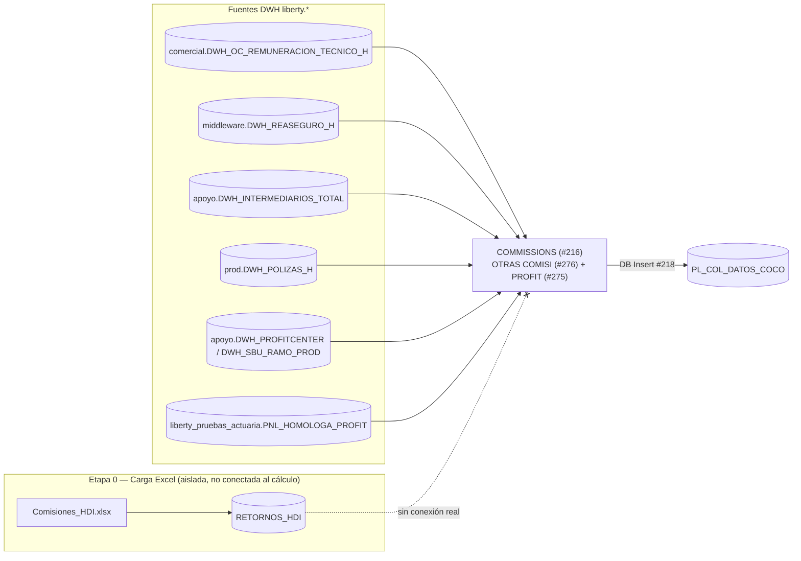

# Flujo que alimenta `PL_COL_DATOS_COCO` (comisiones)

> Nota: en el workflow **no existe** una tabla llamada `pl_col_datos_coco_comisiones`. La tabla real es
> **`PL_COL_DATOS_COCO`**, y el componente que le inyecta las **comisiones** es `COMMISSIONS (#216)`.
> Este documento se centra en esa parte del flujo.

## 1. ¿De dónde vienen los datos de comisiones?

El componente **`COMMISSIONS (#216)`** (carpeta [`sql/COMMISSIONS__216/`](../sql/COMMISSIONS__216/)) calcula:

- **`COMMISSION EXPENSE`** — gasto de comisiones.
- **`REINSURANCE_COMMISSION`** — comisión de reaseguro.

Fuentes SQL (tablas del DWH `liberty`, todas por base de datos, **no Excel**):

| Tabla fuente | Uso |
|---|---|
| `liberty.comercial.DWH_OC_REMUNERACION_TECNICO_H` | Remuneración de intermediarios |
| `liberty.middleware.DWH_REASEGURO_H` | Cesiones de reaseguro |
| `liberty.apoyo.DWH_INTERMEDIARIOS_TOTAL` | Catálogo de intermediarios |
| `liberty.apoyo.DWH_PROFITCENTER` / `DWH_SBU_RAMO_PROD` | Homologación de profit center / SBU |
| `liberty.prod.DWH_POLIZAS_H` | Pólizas |
| `liberty_pruebas_actuaria.dbo.DWH_CORRETAJE_H_COMPLETO` | Base de cocorretaje |
| `liberty_pruebas_actuaria.dbo.PNL_HOMOLOGA_PROFIT` | Homologación de profit center (Etapa 0, ver abajo) |

Dos subcomponentes dentro de `COMMISSIONS (#216)`:
- **`OTRAS COMISI (#276)`** — otras comisiones/retornos.
- **`PROFIT (#275)`** — atribución a profit center.

El resultado final se escribe con el nodo **`DB Insert (#218)`** en la tabla permanente **`PL_COL_DATOS_COCO`**.

## 2. ¿Consume un Excel?

**No directamente en el cálculo de comisiones.** El único Excel relacionado con "comisiones" en todo el workflow es:

| Excel | Tabla destino | ¿Se usa en `COMMISSIONS (#216)`? |
|---|---|---|
| `Comisiones_HDI.xlsx` | `RETORNOS_HDI` | **No** — no aparece referenciada en ningún script SQL de `COMMISSIONS__216`, ni en el resto del flujo conectado. Se carga en la Etapa 0 pero queda huérfana/sin consumo dentro del cálculo activo. |

Es decir: el Excel `Comisiones_HDI.xlsx` se lee al inicio del workflow (nodo `Excel Reader` → `DB Table Creator` → `DB Insert`) y llena la tabla auxiliar `RETORNOS_HDI`, pero **ningún `SELECT`/`JOIN` de los scripts que alimentan `PL_COL_DATOS_COCO` la consulta**. El gasto de comisiones que sí llega a `PL_COL_DATOS_COCO` se calcula 100% desde tablas del DWH (`liberty.*`), no desde el Excel.

> Existen dos variantes adicionales de comisiones (`COMMISSIONS #278` con tablas `amocom.*`, y `COMMISSIONS_ #287`) que **no están conectadas** al nivel superior del workflow — son versiones de respaldo/manuales y tampoco usan el Excel.

## 3. Diagrama del subflujo

## 4. Resumen

- La tabla correcta es **`PL_COL_DATOS_COCO`**, alimentada (entre otros) por `COMMISSIONS (#216)`.
- El cálculo de comisiones **no consume el Excel `Comisiones_HDI.xlsx`**; ese archivo solo carga `RETORNOS_HDI`, tabla que queda sin uso en el flujo activo.
- Todas las fuentes reales del componente de comisiones son tablas del DWH (`liberty.*` y `liberty_pruebas_actuaria.*`).

## Referencias
- [`docs/FLUJO.md`](FLUJO.md) — sección `COMMISSIONS (#216)` (línea ~303) y Etapa 0 (línea ~74).
- [`docs/EXPLICACION_FLUJO.md`](EXPLICACION_FLUJO.md) — sección 5, cargas manuales desde Excel.
- Scripts: [`sql/COMMISSIONS__216/`](../sql/COMMISSIONS__216/)
